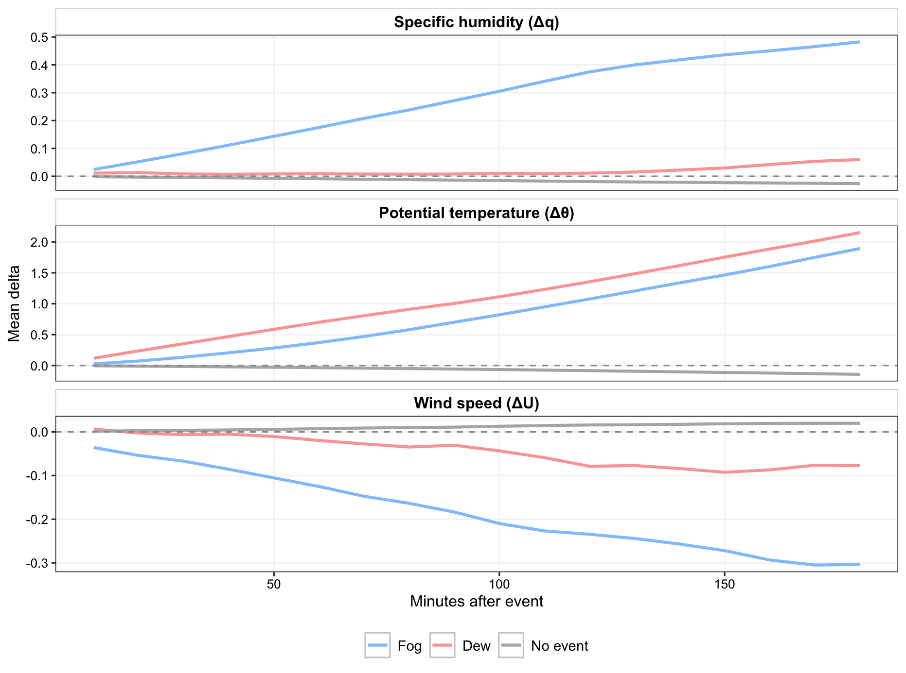
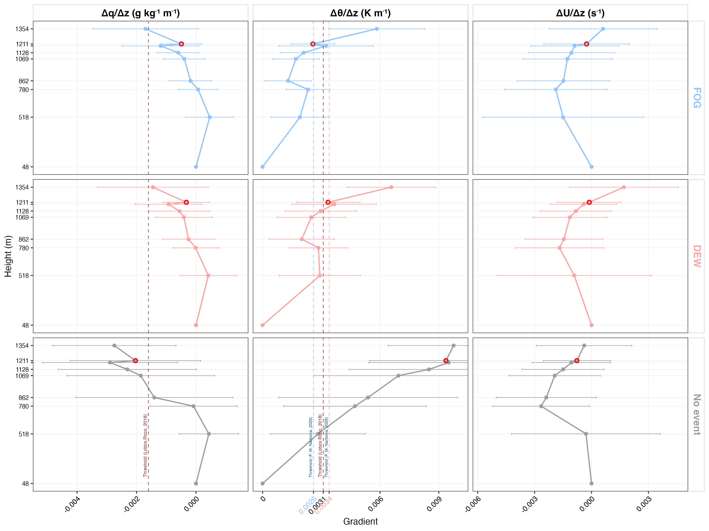

# Thermodynamic Characterization of the Boundary Layer under Fog and Dew Events in the Coastal Hyper-Arid Climate of the Atacama Desert


**Autora:** Francisca Muñoz Narbona\
**Comité de tesis:** Felipe Lobos-Roco (profesor guía); Sara Acevedo y Camilo del Río (profesores informantes)\
**Programa:** Magíster en Recursos Naturales, Facultad de Agronomía y Sistemas Naturales, Pontificia Universidad Católica de Chile\
**Financiamiento:** FONDECYT 11250466

------------------------------------------------------------------------

## Resumen

En el Desierto de Atacama costero, donde las precipitaciones son casi nulas, la niebla y el rocío constituyen las únicas fuentes de agua tanto para los ecosistemas hiperáridos dominados por *Tillandsia landbeckii* como para las comunidades locales que las aprovechan como recurso hídrico complementario. Este trabajo aborda tres problemas acoplados: (i) la diferenciación instrumental de eventos de niebla y rocío mediante visibilidad horizontal terrestre y detección satelital de nubes bajas (GOES-16) integradas en un árbol de decisión jerárquico; (ii) la estabilidad térmica vertical de la capa límite marina bajo cada régimen, caracterizada mediante los gradientes verticales de temperatura potencial ($\theta$), humedad específica ($q$) y velocidad del viento ($U$) a lo largo de una transecta altitudinal (48–1354 m s.n.m.); y (iii) la tendencia temporal de la humedad específica como firma de la fuente de vapor. La reclasificación eleva la fracción de tiempo asignada a rocío puro desde 4.0 % (registro instrumental) a 46.7 % de la ventana de eventos activos. La niebla se asocia a una capa límite comparativamente más mezclada ($\Delta\theta/\Delta z < 0.0026\ \text{K m}^{-1}$) y el rocío a una baja troposfera más estratificada ($0.0026$–$0.0034\ \text{K m}^{-1}$), mientras que los gradientes verticales de humedad y viento no discriminan entre regímenes con la misma magnitud.

**Palabras clave:** niebla, rocío, agua atmosférica, capa límite marina, estabilidad, termodinámica, Desierto de Atacama, *Tillandsia landbeckii*

------------------------------------------------------------------------

## Estructura del repositorio

```
.
├── tesis_magister_francisca_munoz_narbona.qmd   Documento fuente (Quarto) de la tesis
├── tesis_magister_francisca_munoz_narbona.pdf   Render final en PDF
├── calculos_finales.R                           Pruebas estadísticas formales (Kruskal-Wallis,
│                                                 Mann-Whitney con tamaño de efecto de Wilcoxon)
│                                                 reportadas en la sección de Resultados
├── actualizaciones.md                           Bitácora de revisiones estadísticas y de
│                                                 redacción aplicadas a Resultados
├── code/
│   └── 01_ordenar_unir_datos.R                  Ordenamiento e integración de los registros
│                                                 crudos (10 min) de las ocho estaciones de la
│                                                 transecta altitudinal
├── data/
│   ├── oyarbide_procesado_2024-2025_v02/        Series de 10 min por estación de la transecta
│   │                                             (OYA518–OYA1354), 2024-2025
│   ├── aeropuerto/                              Serie de referencia costera al nivel del mar
│   │                                             (Aeropuerto Internacional Diego Aracena)
│   ├── GOES/goes_app/oya24/FLC/                 Detección satelital de nubes bajas (GOES-16, 2024)
│   ├── data_oyarbide_1211_clasificacion_fog-dew_20260308.csv
│   │                                             Clasificación de eventos niebla/rocío en la
│   │                                             estación de anclaje (OYA1211)
│   └── data_oyarbide_aeropuerto_clasificada_theta_q_20260308.csv
│                                                 Gradientes verticales derivados (θ, q, U) por
│                                                 tipo de evento
├── figuras/                                     Figuras finales citadas en el documento
├── resultados/figuras/                          Figuras generadas por el pipeline de análisis,
│                                                 citadas en el documento
├── references_v02.bib, referencias_nuevas_v04.bib   Bibliografía citada
├── apa.csl                                      Estilo de citación (APA)
├── logo_uc.png                                  Logo institucional (portada)
├── poster_cr2_FIMN_2025.pptx                    Póster presentado en la Reunión Anual CR2 2025
└── EGU_poster_v05.pdf                           Póster presentado en la European Geosciences
                                                  Union (EGU) General Assembly
```

------------------------------------------------------------------------

## Resultados principales

**Reclasificación de eventos de agua atmosférica (estación OYA1211, 2024).** La detección instrumental subestima fuertemente el rocío puro (4.0 %); al integrar visibilidad horizontal y detección satelital de nubes bajas (GOES-16), su peso dentro de la ventana de eventos activos sube a 46.7 %.


**Evolución de las variables termodinámicas tras el inicio del evento.** Trayectoria promedio de $\Delta q$, $\Delta\theta$ y $\Delta U$ durante los 180 minutos posteriores al inicio de cada evento (niebla, rocío, sin evento), evidenciando una humidificación sostenida bajo niebla y un calentamiento más marcado bajo rocío.



**Gradientes termodinámicos verticales por tipo de evento.** La niebla se asocia a una capa límite más mezclada ($\Delta\theta/\Delta z < 0.0026$ K/m) y el rocío a una baja troposfera más estratificada ($0.0026$–$0.0034$ K/m); los gradientes de humedad y viento no discriminan entre regímenes con la misma nitidez.



*(Ver todas las figuras de resultados en [`figuras/`](figuras/) y su discusión completa en el documento de tesis.)*

------------------------------------------------------------------------

## Difusión

Resultados preliminares de esta tesis fueron presentados como póster en:

- **Reunión Anual CR2 2025** (Centro de Ciencia del Clima y la Resiliencia) — `poster_cr2_FIMN_2025.pptx`
- **EGU General Assembly** (European Geosciences Union) — `EGU_poster_v05.pdf`

------------------------------------------------------------------------

## Reproducibilidad

1. `code/01_ordenar_unir_datos.R` integra los registros crudos (Excel) de las ocho estaciones de la transecta altitudinal en las series de 10 minutos de `data/oyarbide_procesado_2024-2025_v02/`. Los registros crudos no se distribuyen en este repositorio (ver *Disponibilidad de datos*).
2. La clasificación de eventos de niebla/rocío (@sec-classification del documento) y la derivación de los gradientes verticales de $\theta$, $q$ y $U$ (@sec-thermo) se generaron en un flujo de trabajo exploratorio que no forma parte de esta versión del repositorio; sus productos finales se incluyen directamente como `data/data_oyarbide_1211_clasificacion_fog-dew_20260308.csv` y `data/data_oyarbide_aeropuerto_clasificada_theta_q_20260308.csv`.
3. `calculos_finales.R` recalcula, a partir de esos dos archivos, los gradientes verticales, las tasas de cambio temporal y las pruebas estadísticas formales citadas en Resultados.
4. El documento se renderiza con [Quarto](https://quarto.org):

   ```bash
   quarto render tesis_magister_francisca_munoz_narbona.qmd --to pdf
   ```

   Requiere una distribución de LaTeX con soporte para XeLaTeX, `polyglossia`, `titlesec`, `parskip`, `fancyhdr`, y la fuente Arial disponible en el sistema.

------------------------------------------------------------------------

## Disponibilidad de datos

Este repositorio incluye los datos procesados necesarios para reproducir los análisis y figuras del documento. Los registros crudos de las estaciones (formato Excel, ~9.6 GB) y la bibliografía de referencia con derechos de autor de terceros no se distribuyen aquí; están disponibles bajo solicitud a la autora.
