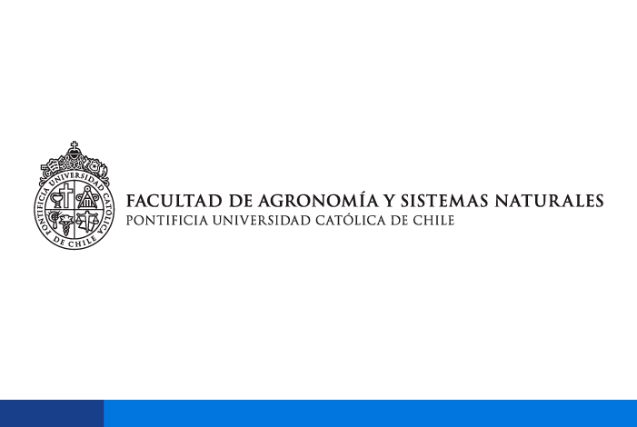

#  MBL Fog & Dew Thermodynamics 

> **Investigadora:** Francisca Muñoz Narbona  
> **Programa:** Magíster en Recursos Naturales  
> **Institución:** Facultad de Agronomía e Ingeniería Forestal, Pontificia Universidad Católica de Chile (PUC)  
> **Año de estudio:** 2024  

---

<p align="center">
  <a href="https://francisca-imn-mbl-fog-dew-thermodynamics.share.connect.posit.cloud/">
    
  </a>
</p>

## 📋 Descripción del Proyecto

Esta aplicación web interactiva, desarrollada en **R Shiny**, forma parte de una investigación de tesis enfocada en la dinámica micrometeorológica y termodinámica de la **niebla (*fog*) y el rocío (*dew*)** en el desierto de Atacama. 

El sistema centraliza y evalúa una red geoespacial de estaciones meteorológicas distribuidas en una **transecta altitudinal** (desde el nivel del mar hasta los 1,354 m s.n.m.), permitiendo analizar fenómenos críticos como la inversión térmica, la altura de la base de las nubes y el rendimiento de la captación hídrica.

---

## 🛠️ Módulos de la Aplicación

La plataforma está estructurada en cuatro paneles principales diseñados para la exploración analítica de los datos meteorológicos recopilados durante el ciclo 2024:

1. **Resumen y Transecta:** Muestra el perfil altitudinal de las estaciones (desde el *Aeropuerto* basal pasando por las estaciones *Oya_518* hasta *Oya_1354*). Incluye una **Matriz de Disponibilidad de Datos (%)** interactiva que detalla la completitud temporal de variables clave en pasos de tiempo de 10 minutos.
2. **Captación Crítica (Agua):** Módulo dedicado al análisis del rendimiento de captación de agua a partir de eventos de niebla y rocío en la transecta.
3. **Variables Dinámicas:** Graficador interactivo temporal que permite aislar series de tiempo meteorológicas (Temperatura, Humedad, Presión, Radiación, etc.), comparar estaciones en simultáneo y filtrar ventanas específicas de fechas.
4. **Visibilidad y GOES:** Integra la visibilidad corregida superficial junto con la presencia discreta de nubes bajas (FLC - *Fractional Low Clouds*) derivadas de imágenes satelitales del píxel GOES sobre la zona de estudio.

---

## 📂 Estructura del Repositorio

* `app.R`: Código principal de la aplicación Shiny (UI y Server).
* `manifest.json`: Configuración de despliegue automatizado en la nube (Git-backed deployment).
* `data/`: Carpeta con los archivos `.csv` optimizados y procesados con la resolución temporal de 10 minutos.
* `logo_fasina.png`: Escudo de la Facultad de Agronomía e Ingeniería Forestal (PUC).
* `borrador_escrito.qmd`: Documento fuente en Quarto con el desarrollo de la tesis.

---

## 🚀 Cómo Ejecutar de Forma Local

Si deseas clonar este repositorio y ejecutar la aplicación en tu computadora, asegúrate de tener instalado **R** y **RStudio**, luego corre las siguientes líneas en tu consola:

```r
# Instalar los paquetes necesarios
install.packages(c("shiny", "shinydashboard", "ggplot2", "plotly", "DT", "tidyverse"))

# Clonar el repositorio y ejecutar
shiny::runGitHub("francisca-imn/mbl-fog-dew-thermodynamics", ref = "main")