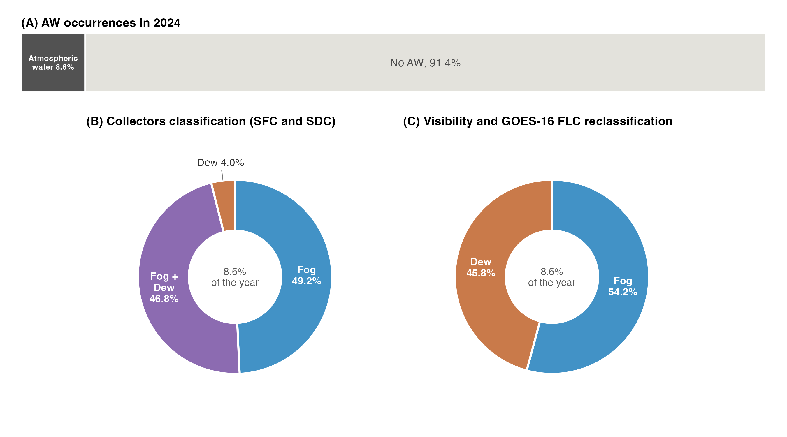
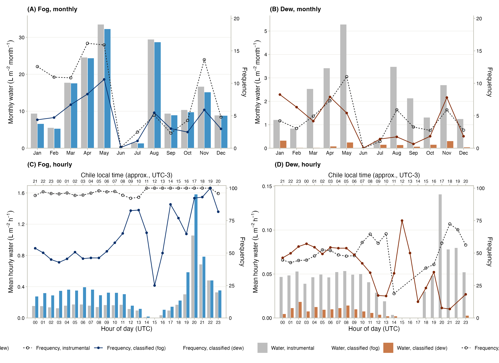
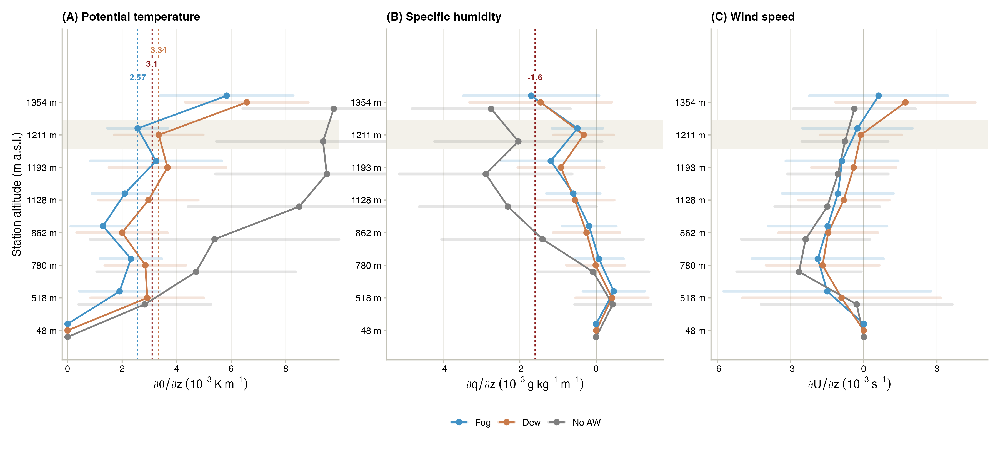
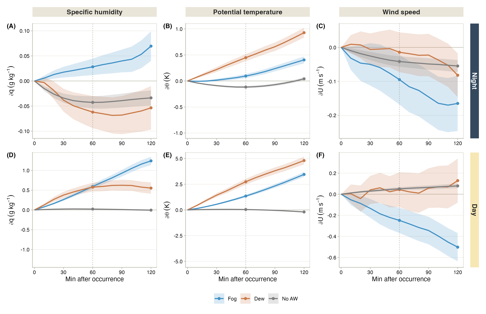
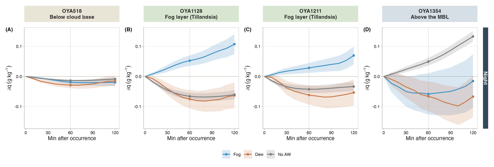

# Thermodynamic characterization of the marine boundary layer during fog and dew occurrences in the hyperarid coastal climate of the Atacama Desert

[](https://doi.org/10.5281/zenodo.23923677)

This repository holds the code, figures, manuscript and presentations of the manuscript *Thermodynamic characterization of the marine boundary layer during fog and dew occurrences in the hyperarid coastal climate of the Atacama Desert* by F.M. Narbona, S. Acevedo, C. Del Río, A. Siegmund and F. Lobos-Roco. The manuscript is prepared for submission to the Journal of Arid Environments.

The work comes from the MSc thesis of Francisca M. Narbona (Magíster en Recursos Naturales, Facultad de Agronomía y Sistemas Naturales, Pontificia Universidad Católica de Chile). It was funded by FONDECYT 11250466.

## Dissemination of this work

The study was presented at five activities between 2025 and 2026, from the first results to the final thesis defense. Each folder in [`presentations/`](presentations/) contains the final version of the poster or talk.

| Date | Activity | Event | Language | File |
|------|----------|-------|----------|------|
| 2025 | Poster | Symposium of the Center for Climate and Resilience Research (CR2), Viña del Mar, Chile | Spanish | [`poster_CR2-symposium_2025_Munoz-Narbona.pptx`](presentations/2025_CR2-symposium_poster/poster_CR2-symposium_2025_Munoz-Narbona.pptx) |
| 2026 | Poster | EGU General Assembly 2026, Vienna, Austria | English | [`poster_EGU-GA_2026_Munoz-Narbona.pdf`](presentations/2026_EGU-General-Assembly_poster/poster_EGU-GA_2026_Munoz-Narbona.pdf) |
| 31 Jul 2026 | Talk | Scientific outreach seminar at Cienciambiental (environmental consulting), Chile | Spanish | [`talk_Cienciambiental_2026-07-31_Munoz-Narbona.pptx`](presentations/2026-07-31_Cienciambiental_talk/talk_Cienciambiental_2026-07-31_Munoz-Narbona.pptx) |
| 25–28 Aug 2026 | Talk (virtual, 15 min) | Research Software Latinoamérica (RSLA26): *An open software ecosystem for reproducible science. Case study: the marine boundary layer under fog and dew in the Atacama Desert* | Spanish | [`talk_RSLA26_Munoz-Narbona.pptx`](presentations/2026-08_RSLA26_talk/talk_RSLA26_Munoz-Narbona.pptx) (Quarto source: [`.qmd`](presentations/2026-08_RSLA26_talk/talk_RSLA26_Munoz-Narbona.qmd)) |
| 10 Sep 2026 | MSc thesis defense | Magíster en Recursos Naturales, Pontificia Universidad Católica de Chile | Spanish | [`MSc-thesis-defense_2026-09-08_Munoz-Narbona.pptx`](presentations/2026-09-08_MSc-thesis-defense/MSc-thesis-defense_2026-09-08_Munoz-Narbona.pptx) |


## Abstract

In the hyperarid coastal Atacama Desert, fog and dew are the main water sources for ecosystems like *Tillandsia landbeckii* and for local communities. However, distinguishing the water contributions of fog and dew to the local water balance remains highly uncertain because standard fog and dew collectors' measurements overlap. In this work, we reclassify fog and dew occurrences measured by collectors using ground-based visibility and satellite fog and low cloud (FLC) criteria. Moreover, we analyse the thermodynamic vertical structure of the marine boundary layer and its temporal tendency under reclassified fog and dew events using a nine-station topographic transect at the coastal mountain range (48 to 1354 m asl). Our main results indicate that atmospheric water (AW) episodes occur in 8.6% of the year, of which fog collection corresponds to 4.2%, dew to 0.3%, and there is an overlap between fog and dew collection of about 4.1%. However, when AW occurrences are reclassified using the visibility criteria, fog corresponds to 4.7% and dew to 3.9%. Our observations suggest that fog and dew occur under different thermal stability: fog ~2.57×10⁻³ K m⁻¹ (well-mixed) and dew > 3.34×10⁻³ K m⁻¹ (stratified). The specific humidity tendency shows that over the night, the air dries at a rate of −0.06 g kg⁻¹ h⁻¹ during dew episodes, while it slightly increases at a rate of 0.03 g kg⁻¹ h⁻¹ under fog episodes. This tendency intensifies over *Tillandsia landbeckii* fields compared to bare soil. Our work suggests a feasible methodology for observational distinction and characterisation of fog and dew, applicable to broad hyperarid environments.

*Keywords*: Fog; dew; marine boundary layer; atmospheric stability; Atacama Desert

## Main results by specific objective

The analysis uses one year (2024) of 10-min data from the Cerro Oyarbide topographic transect, at about 20.61°S, 70.07°W. The transect has nine stations between 48 and 1354 m asl. The main station is OYA1211, on the upper border of the *Tillandsia landbeckii* fields. It has a standard fog collector (SFC), a standard dew collector (SDC) and a visibility sensor. All figures are in [`figures/`](figures/), and the figure file at 300 dpi is [`manuscript/figures_300dpi_v12.docx`](manuscript/figures_300dpi_v12.docx).

### SO1. Hierarchical classification of fog and dew occurrences (Section 3.1)

- **Criterion.** An occurrence with water in the SFC or the SDC is classified as fog if visibility is below 1000 m. It is classified as dew if visibility is 1000 m or more. When visibility is missing, GOES-16 FLC detection (2 km) is used. This is followed by a manual review.
- **Frequency.** Atmospheric water is collected only 8.6% of the time in 2024.
- **Collector-based classification.** Of the AW records, 49.2% are fog only, 46.8% are both collectors and 4.0% are dew only.
- **Reclassification.** The split becomes 54.2% fog and 45.8% dew, that is, 4.7% and 3.9% of the year. The dew fraction grows by one order of magnitude.
- **Independent check.** The fog frequency agrees with two measures that do not depend on the collectors: GOES-16 FLC over the station (4.4% of the time) and visibility below 1000 m (5.2%).
- **Collected water.** The collectors register 191 L m⁻² yr⁻¹ (SFC 167, SDC 24). After the reclassification, 159 L m⁻² yr⁻¹ is attributed to fog and only 1.5 L m⁻² yr⁻¹ to dew. 94% of the water collected by the SDC was collected during fog, so SDC yields at fog-exposed sites may largely reflect fog water.

**Figure 2.** Classification of AW occurrences at OYA1211 during 2024: (A) share of the year with AW, (B) collector-based classification, (C) reclassification based on visibility and GOES-16 FLC.



**Figure 4.** Seasonal (A, B) and diurnal (C, D) distribution of fog and dew at OYA1211. Bars show the total monthly water (A, B) and the mean hourly water on the hours with water (C, D). Grey is the collector-based value and colour the reclassified one. Lines show the frequency over all records of each month (A, B) and over the AW records of each hour (C, D).



### SO2. Atmospheric stability through the thermodynamic vertical gradients (Section 3.2)

- **∂θ/∂z separates the regimes.** At OYA1211 the mean is 2.57×10⁻³ K m⁻¹ under fog, 3.34×10⁻³ K m⁻¹ under dew and 9.4×10⁻³ K m⁻¹ with no AW. Fog occurs under a well-mixed marine boundary layer, dew under a slightly stratified one and no AW under a strongly stratified one. The groups differ significantly (Kruskal–Wallis χ² = 9116.2; Mann–Whitney fog vs dew r = 0.25, p < 0.001).
- **Thresholds from ROC curves (Youden index).**
  - Fog vs dew: 3.4×10⁻³ K m⁻¹, AUC = 0.64, accuracy 63%.
  - Dew vs no AW: 5.3×10⁻³ K m⁻¹, AUC = 0.94, accuracy 86%.
  - These values refine the 3.1×10⁻³ K m⁻¹ threshold of Lobos Roco et al. (2018), which separated fog from no fog but did not distinguish dew.
- **The ∂θ/∂z distributions overlap.** The fog and dew distributions overlap, so the thresholds are given together with the mean ± 1 standard deviation of each regime (Table 2).
- **∂q/∂z** does not separate fog from dew (−4.9×10⁻⁴ vs −3.3×10⁻⁴ g kg⁻¹ m⁻¹ at OYA1211). It does separate fog and dew together from no AW: AUC = 0.69, cut-off −1.7×10⁻³ g kg⁻¹ m⁻¹. This confirms the −1.6×10⁻³ g kg⁻¹ m⁻¹ threshold of Lobos Roco et al. (2018).
- **∂U/∂z** does not differ between fog, dew and no AW.

**Figure 6.** Mean vertical gradients of (A) θ, (B) q and (C) U between the coastal station (48 m asl) and each station of the transect, for fog, dew and no AW occurrence (mean ± 1 SD).



**Table 2.** Thresholds of the vertical gradients between the coastal station (48 m asl) and OYA1211, from the optimal cut-off (Youden index) of the ROC curves, with the mean and mean ± 1 standard deviation (SD) of each regime at OYA1211 in 2024. Values in units of 10⁻³ (∂θ/∂z in K m⁻¹, ∂q/∂z in g kg⁻¹ m⁻¹).

| Regime | ∂θ/∂z threshold | ∂θ/∂z mean | mean − SD | mean + SD | ∂q/∂z threshold | ∂q/∂z mean | mean − SD | mean + SD |
|:-------|:------:|:------:|:------:|:------:|:------:|:------:|:------:|:------:|
| Fog | < 3.4 | 2.57 | 1.46 | 3.68 | −1.7 to 0 | −0.49 | −1.16 | 0.17 |
| Dew | 3.4 to 5.3 | 3.34 | 1.71 | 4.97 | −1.7 to 0 | −0.33 | −1.11 | 0.46 |
| No AW | > 5.3 | 9.36 | 5.45 | 13.28 | ≤ −1.7 | −2.04 | −4.23 | 0.16 |

### SO3. Temporal tendency of the thermodynamic variables (Section 3.3)

- **Specific humidity at night.** In the first hour, *q* at OYA1211 decreases after dew (−0.06 g kg⁻¹ h⁻¹) and increases slightly after fog (+0.03 g kg⁻¹ h⁻¹). During the day it increases under both fog and dew (~0.59 g kg⁻¹ in the first hour).
- **Potential temperature.** It warms after dew at night (0.45 K h⁻¹, concentrated at the end of the dew occurrences). During the day it warms faster under dew than under fog (2.74 vs 1.35 K h⁻¹). The daytime ∂θ/∂t gives the largest fog–dew difference: effect size r = 0.41, AUC = 0.76, cut-off 1.9 K h⁻¹, accuracy 74%.
- **Wind speed.** It decreases after fog (−0.09 m s⁻¹ h⁻¹ at night, −0.25 m s⁻¹ h⁻¹ during the day) and barely changes after dew.
- **Along the transect.** The nocturnal drying after dew appears at the two stations over the *Tillandsia* fields (OYA1128: −0.08 g kg⁻¹ h⁻¹; OYA1211: −0.06 g kg⁻¹ h⁻¹). Below the cloud base (OYA518), *q* barely changes. This suggests an active role of the *Tillandsia* surface in dew formation.

**Figure 8.** Mean change of q, θ and U at OYA1211 from 10 to 120 min after each record reclassified as fog, dew or no AW occurrence, at night and during the day (95% confidence interval).



**Figure 9.** Nocturnal mean change of q from 10 to 120 min after fog, dew and no AW records at OYA518, OYA1128, OYA1211 and OYA1354.



## Repository structure

```
.
├── README.md
├── run_pipeline.R                         Single entry point: settings + TRUE/FALSE switches of every output
├── code/
│   ├── R/                                 Functions used by run_pipeline.R
│   │   ├── pipeline_core.R                    Input table, fog/dew classification, θ, q and vertical gradients
│   │   ├── statistics.R                       Event-based statistics and seasonal ∂θ/∂z values
│   │   ├── paper_figures.R                    Figures 2 to 9 and A1 of the manuscript
│   │   └── reports.R                          Plots of the .docx reports and their rendering with Quarto
│   ├── reports/                           Quarto sources of the .docx reports (rendered by run_pipeline.R)
│   │   ├── classification_daily.qmd           Half-month panels of the daily classification
│   │   ├── vertical_profiles_daily.qmd        One page per day: θ, q, U profiles and their ∂/∂z
│   │   ├── temporal_tendencies.qmd            Mean temporal tendencies after fog, dew and no AW
│   │   └── paper_figures.qmd                  Figures of the manuscript with their captions
│   ├── config/
│   │   ├── manual_corrections_oya1211_2024.R  Manual corrections of the classification (74 windows)
│   │   └── paper_figure_captions.csv          Captions of the figures (Manuscript-SA_v07)
│   └── prep_oyarbide/                     Preparation of the Cerro Oyarbide input table
│       ├── 01_merge_station_files.R           Merge the raw station files (xlsx) into one 10-min series per station
│       ├── 02_build_dataset.qmd               Join stations, airport and GOES-16 FLC; cleaning; data availability (Table 1)
│       └── 03_standard_table.R                Write the input table of run_pipeline.R (with station altitude)
├── data/                                  Not versioned (see Data availability); structure expected by the code
│   ├── raw/stations_xlsx/OYA_xxx/             Raw station files (xlsx)
│   ├── stations/                              10-min series per station, 2024-2025 (output of prep step 1)
│   ├── airport/                               Coastal reference station (Diego Aracena airport, 48 m)
│   ├── goes/                                  GOES-16 FLC detection over OYA1211, 2024
│   └── derived/                               Input table and derived tables
├── figures/                               Figures of the manuscript (fig01 to fig09, figA1)
├── results/                               Statistics and values used in the text (CSV)
├── output/                                .docx reports (not versioned, created by run_pipeline.R)
├── manuscript/
│   ├── manuscript_v12.docx                    Final manuscript (Journal of Arid Environments)
│   ├── figures_300dpi_v12.docx                Figures and captions at 300 dpi
│   ├── manuscript.qmd, references.bib         Quarto source with the Elsevier template (earlier draft)
│   ├── partials/, _extensions/elsevier/       Elsevier template files
│   └── borrador/                              Earlier draft with co-author comments
└── presentations/                         Posters and talks (see "Dissemination of this work")
```

## How to run

Everything is produced by one script, from the repository root:

```r
source("run_pipeline.R")      # in RStudio / Positron
```

or `Rscript run_pipeline.R` from a terminal. At the top of `run_pipeline.R` you choose which outputs are generated (`TRUE`/`FALSE`), the input file and its column names, the reference and main stations, the thresholds and the options of the reports. Nothing below the line "From here on nothing needs to be edited" needs to be changed.

| Switch | Output |
|--------|--------|
| `derived_tables` | `data/derived/oya1211_classification_2024.csv` (classification of every 10-min record of the main station) and `data/derived/stations_theta_q_2024.csv` (θ, q and pressure of every station and record) |
| `statistics_events` | `results/event_statistics.csv`: event-based Mann–Whitney tests, AUC and Youden cut-offs with bootstrap CI (Sections 3.2 and 3.3, Table 2) |
| `seasonal_thresholds` | `results/seasonal_dtheta_dz_values.csv`: seasonal ∂θ/∂z values at the main station |
| `paper_figures_png` | `figures/fig02` to `fig09` and `figA1` (300 dpi) and the values quoted in the text (`results/paper_values/`) |
| `docx_classification` | `output/classification_daily.docx`: visibility, classification and FLC for each day, in half-month panels, before and after the manual corrections, with the corrected windows |
| `docx_daily_profiles` | `output/vertical_profiles_daily.docx`: one page per day with the hourly profiles of θ, q and U and of ∂θ/∂z, ∂q/∂z and ∂U/∂z |
| `docx_temporal_tendencies` | `output/temporal_tendencies.docx`: mean accumulated change of q, θ and U after fog, dew and no AW, at night and during the day, at the main station and along the transect, and its mean diurnal cycle |
| `docx_paper_figures` | `output/paper_figures.docx`: Figures 1 to 9 and A1 with their captions |

The daily reports include, by default, only the days with at least one fog or dew record (`daily_days = "aw"`; use `"all"` or a vector of dates for other days).

Requirements: R ≥ 4.3 with tidyverse, lubridate, scales, patchwork, cowplot, pROC, knitr and rmarkdown (ggplot2 ≥ 3.5, for `sec_axis(transform = ...)`), and [Quarto](https://quarto.org) ≥ 1.4 for the .docx reports (the Quarto bundled with RStudio or Positron is found automatically). The preparation scripts also use readxl, janitor, plotly and kableExtra. Times are UTC. Chile local time is UTC−4 (UTC−3 during daylight saving time).

### Quick demo

A short run that shows how the pipeline works without overwriting the derived tables or the figures of the paper:

1. Build the input table once: `Rscript code/prep_oyarbide/03_standard_table.R`.
2. In section 1 of `run_pipeline.R`, set every switch to `FALSE` except `docx_classification` (and, if wanted, `docx_daily_profiles`).
3. In section 4, choose a few days, e.g. the typical dew and fog days: `daily_days <- as.Date(c("2024-04-24", "2024-04-28"))`.
4. Run `source("run_pipeline.R")` and open the report in `output/` (less than a minute).

Keep `derived_tables` and `paper_figures_png` set to `FALSE` while trying other settings (e.g. `visibility_fog_threshold`): with `TRUE` they overwrite `data/derived/` (not versioned) and `figures/`. The full run takes about 4 minutes.

### Input table

`run_pipeline.R` starts from one CSV with one row per station and 10-min time step. The column names are set in `columns`, so other names can be used; optional variables can be set to `NA`.

| Variable | Description | Needed at |
|----------|-------------|-----------|
| `datetime` | Time stamp (UTC) | all stations |
| `station` | Station name | all stations |
| `z_m` | Station altitude (m a.s.l.) | all stations |
| `temperature` | Air temperature (°C) | all stations |
| `rh` | Relative humidity (%) | all stations |
| `pressure` | Measured pressure (hPa); where missing, it is estimated with the hypsometric equation from the reference station | reference station |
| `wind_speed` | Wind speed (m s⁻¹) | all stations |
| `radiation` | Global radiation (W m⁻²), for the night/day split | main station |
| `visibility` | Horizontal visibility (m) | main station |
| `fog_water`, `dew_water` | Water of the standard fog and dew collectors (mL m⁻²) | main station |
| `flc` | Satellite fog and low clouds detection (0/1), used when visibility is missing (optional) | main station |

The input table is expected to be clean (logger artefacts set to missing). For Cerro Oyarbide it is built by the three scripts of `code/prep_oyarbide/`, run in order from the repository root (`02_build_dataset.qmd` is rendered from its folder):

| Step | Script | Input | Output |
|------|--------|-------|--------|
| 1 | `code/prep_oyarbide/01_merge_station_files.R` | `data/raw/stations_xlsx/` | `data/stations/oya_xxx_2024-2025.csv` |
| 2 | `code/prep_oyarbide/02_build_dataset.qmd` | `data/stations/`, `data/airport/`, `data/goes/` | `data/derived/stations_10min_2024.csv` |
| 3 | `code/prep_oyarbide/03_standard_table.R` | `stations_10min_2024.csv` | `data/derived/transect_10min_2024.csv` (input of `run_pipeline.R`) |

### Reproducibility check

With the 2024 data of Cerro Oyarbide, `run_pipeline.R` reproduces exactly the derived tables of the previous step-by-step scripts, the event-based statistics of Manuscript-SA_v07, the seasonal ∂θ/∂z values and Figures 2 to 9 and A1 (pixel-identical PNG files, rendered with the same package versions).

## Data dictionary

Column names of the derived files are kept in Spanish for compatibility with the original processing.

| Column | Description |
|--------|-------------|
| `datetime` | Time stamp (UTC), 10-min resolution |
| `estacion` | Station: `AEROPUERTO` (48 m), `OYA_518`, `OYA_780`, `OYA_862`, `OYA_1069`, `OYA_1128`, `OYA_1193`, `OYA_1211`, `OYA_1354`, `GOES` (rows with the satellite FLC signal) |
| `temperatura` | Air temperature (°C) |
| `humedad` | Relative humidity (%) |
| `presion` | Measured air pressure (hPa); NA where not measured |
| `radiacion_w_m2` | Global radiation (W m⁻²) |
| `viento_vel_m_s` | Wind speed (m s⁻¹); hourly at the airport |
| `viento_dir` | Wind direction (°) |
| `visibilidad`, `vis_m` | Horizontal visibility (m), OYA1211 only |
| `niebla_final` | Water collected by the standard fog collector (SFC) in the 10-min interval (mL m⁻²) |
| `rocio_final` | Water collected by the standard dew collector (SDC) in the 10-min interval (mL m⁻²) |
| `FLC` | GOES-16 fog and low clouds detection (1 = detected) |
| `fog_cap`, `dew_cap`, `any_cap` | 1 if the fog collector, the dew collector, or any of them registered water |
| `fog_sat` | 1 if GOES-16 detects FLC over OYA1211 |
| `clasif_evento` | Reclassification of the record at OYA1211: `NIEBLA` (fog), `ROCIO` (dew), `SIN_EVENTO` (no AW occurrence) |
| `z_m` | Station altitude (m asl) |
| `presion_final` | Pressure used in the calculations (measured, or hypsometric from the coastal reference) (hPa) |
| `theta_K` | Potential temperature referred to the coastal reference pressure (K) |
| `q_kgkg`, `q_gkg` | Specific humidity (kg kg⁻¹, g kg⁻¹) |

## Notes

- **Manual review.** The manual corrections of the classification are listed in `code/config/manual_corrections_oya1211_2024.R` and shown, window by window, in `output/classification_daily.docx`. On 8 October 2024, the window from 16:00 to 23:00 UTC is classified as fog: visibility was about 500 m and the fog collector registered about 4.7 L.
- **Airport wind.** The airport wind record is hourly, so ∂U/∂z is hourly.
- **Missing values.** Zero values of temperature, pressure and wind speed are treated as missing in preparation step 2.
- **OYA1069.** This station has no valid temperature or wind data in 2024 and is omitted from the gradient figures.

## Data availability

The data used in this work is available at <https://doi.org/10.5281/zenodo.21826557>. The `data/` folder is not versioned in git.

## How to cite

> M. Narbona, F., Lobos-Roco, F., Del Río, C., & Acevedo, S. (2026). Thermodynamic characterization of fog and dew in the Atacama coastal desert (Version v2.0.0) [Computer software]. Zenodo. https://doi.org/10.5281/zenodo.23923677

## Use of AI

Generative AI (Claude, Anthropic) was used mainly to support the writing of the manuscript and this repository and to translate the text into English.
