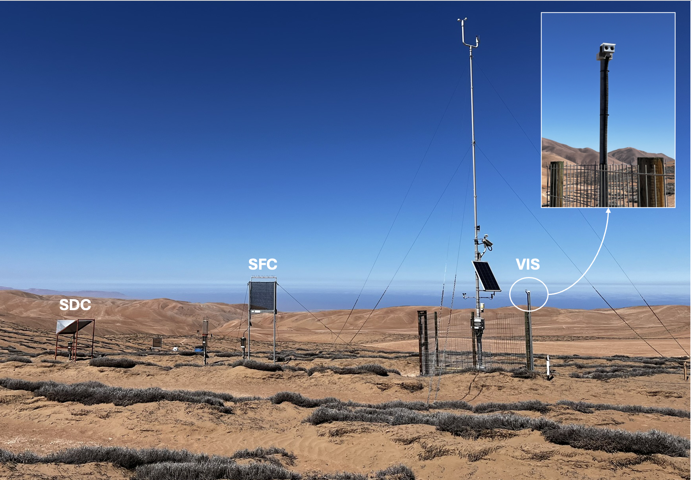

# Introducción {#sec-intro}

En el Desierto de Atacama costero, una de las regiones más áridas del planeta, las precipitaciones son prácticamente nulas de forma permanente. En este contexto, la niebla y el rocío constituyen las principales fuentes de agua disponibles, tanto para los ecosistemas hiperáridos, e incluso de insumo para las comunidades locales que habitan la franja costera [@Garca2021; @Ritter2019]. El componente vegetal dominante de estos oasis de niebla es la bromeliácea *Tillandsia landbeckii*, una planta funcionalmente carente de raíces que absorbe agua y nutrientes directamente desde la atmósfera mediante tricomas en sus hojas, y que forma parches discretos de vegetación ("lomas") sobre el relieve costero [@Pinto2006; @Garca2021; @Koch2019]. Dado que *T. landbeckii* depende del agua atmosférica para su provisión hídrica, su distribución espacial se restringe a las áreas abastecidas con frecuencia suficiente, lo que la convierte en un indicador sensible de la dinámica espacial de las nubes bajas [@Hesse2012; @delRo2021b]. En términos de recurso para consumo humano, la cantidad de agua de niebla colectable en la costa de Atacama se estima entre 1 y 10 $\text{L m}^{-2}\text{ d}^{-1}$ [@Cereceda2008], mientras que el rocío aporta una fracción menor pero persistente, del orden de $0.1\ \text{L m}^{-2}\text{ d}^{-1}$ [@LobosRoco2024]; ambos fenómenos ofrecen un recurso complementario frente a la escasez hídrica de las comunidades del desierto costero [@Fessehaye2014]. El esfuerzo de investigación, no obstante, se ha concentrado históricamente en la niebla, mientras que el rocío permanece comparativamente poco caracterizado; existen indicios de que ejercería sobre el ecosistema una influencia comparable a la de la niebla, aunque su contribución no puede aislarse con los colectores tradicionales.

En efecto, cuantificar de manera separada el aporte de cada fuente constituye un problema abierto de origen instrumental. Tradicionalmente, las nubes bajas y la niebla costera (*Fog and Low Clouds*, FLC) se han monitoreado horizontalmente mediante sensores remotos de gran escala, lo que optimiza la comprensión de su distribución espacial pero restringe severamente la caracterización de su estructura vertical dentro de la Capa Límite Marina (MBL). Innovaciones recientes como el Sistema de Observación Óptica de Niebla Terrestre (GOFOS) han permitido registrar directamente la base y el tope de las nubes, mejorando la resolución vertical [@delRo2021]. Pese a estos avances en el estudio de la niebla, el rocío permanece escasamente caracterizado y es frecuentemente confundido con la niebla en mediciones de campo por limitaciones instrumentales [@Jacobs2006; @Ritter2019]. Los dispositivos de recolección más comunes, es decir, los colectores estándar de niebla (SFC) [@Schemenauer1994] y los colectores pasivos de rocío (SDC), no discriminan entre los mecanismos termodinámicos que originan cada fenómeno ni sus tiempos de formación, y pueden registrar agua de forma cruzada (*crosstalk*), dificultando la identificación de la fuente que efectivamente aporta agua cuando ambos coexisten.

La diferenciación es relevante porque niebla y rocío se originan bajo condiciones atmosféricas distintas y dejan firmas termodinámicas contrastantes en la baja atmósfera. La niebla costera resulta de la advección de estratocúmulos marinos formados sobre el Pacífico Sudeste, un proceso que requiere una MBL comparativamente bien mezclada y una fuerte inversión térmica en el tope de la capa [@LobosRoco2018; @Wood2012]. El rocío, en cambio, se forma por enfriamiento radiativo nocturno de la superficie por debajo del punto de rocío, lo que exige una baja troposfera más estratificada y estable [@Ritter2019; @Agam2006]. Esta divergencia sugiere que la estabilidad térmica vertical, cuantificada mediante el gradiente de temperatura potencial ($\Delta\theta/\Delta z$), podría operar como discriminador físico entre ambos regímenes. No obstante, los umbrales de estabilidad propuestos para el norte de Chile se han calibrado casi exclusivamente para separar "niebla" de "no niebla", sobre bases de datos reducidas y sin incorporar el rocío como categoría independiente [@LobosRoco2018; @LobosRoco2024], dejando abierta la pregunta de si estos regímenes son efectivamente separables de forma continua.

Más allá de la estructura estática de estabilidad, la fuente de humedad de cada fenómeno debería quedar impresa en la evolución temporal del vapor de agua y en el intercambio de calor latente en superficie. Mediciones preliminares sugieren que, durante la niebla, la humedad específica tiende a mantenerse o aumentar ($\Delta q/\Delta t \approx +0.016\ \text{g kg}^{-1}\text{ h}^{-1}$), consistente con una advección continua de aire oceánico húmedo, mientras que el rocío se asocia a una marcada reducción de la humedad en el tiempo ($\Delta q/\Delta t \approx -0.25\ \text{g kg}^{-1}\text{ h}^{-1}$), indicando una transferencia neta de vapor hacia la superficie [@LobosRoco2024]. El signo de esta tendencia es, en esencia, un indicador de la dirección del flujo de calor latente ($LE$) en superficie: la niebla se sostiene por un aporte advectivo de vapor asociado al forzamiento oceánico regional [@LobosRoco2021], en tanto que el rocío corresponde a una condensación radiativa local en la que la superficie actúa como sumidero de humedad y libera calor latente al condensar [@Agam2006]. Interpretar $\Delta q/\Delta t$ como una firma del flujo de calor latente permite vincular las mediciones puntuales de las estaciones con los procesos advectivos y radiativos de mayor escala que gobiernan cada evento.

En síntesis, la comprensión hidrometeorológica del Desierto de Atacama costero presenta tres brechas acopladas: la imposibilidad instrumental de segregar niebla y rocío, la ausencia de umbrales de estabilidad que separen ambos fenómenos y la falta de una caracterización de sus tendencias de humedad y de calor latente sobre registros continuos y extensos. El Cerro Oyarbide, un campo de lomas dominado por *Tillandsia landbeckii* y representativo de las condiciones hiperáridas del desierto costero de Atacama, constituye un laboratorio natural idóneo para abordar estas brechas. Sobre esta base, el presente trabajo aborda una pregunta de investigación central: ¿qué diferencias existen en la termodinámica atmosférica y en su interacción con la superficie bajo eventos de niebla y rocío en el Desierto de Atacama? Para responderla se plantean tres hipótesis. En primer lugar, se postula que los colectores mecánicos sobreestiman la coocurrencia de niebla y rocío por interferencia instrumental, de modo que una clasificación independiente basada en la visibilidad horizontal y la detección satelital revelará que el rocío constituye un aporte propio, sustancialmente mayor que el inferido por los instrumentos (H1). En segundo lugar, se plantea que la niebla se asocia a una capa límite comparativamente más mezclada (menor $\Delta\theta/\Delta z$) y el rocío a una baja troposfera más estratificada y estable (mayor $\Delta\theta/\Delta z$), mientras que los gradientes verticales de humedad ($\Delta q/\Delta z$) y de viento ($\Delta U/\Delta z$) no discriminan entre regímenes, debido a la saturación y mezcla generalizadas de la capa límite marina (H2). En tercer lugar, se espera que la niebla mantenga o incremente la humedad específica en el tiempo ($\Delta q/\Delta t \geq 0$) por advección marina continua, en tanto que el rocío la reduzca ($\Delta q/\Delta t < 0$) al condensar vapor sobre la superficie (que opera como sumidero de humedad), reflejando direcciones opuestas del flujo de calor latente en superficie (H3).

# Marco Teórico {#sec-marco}

## La Capa Límite Atmosférica y las Variables Termodinámicas Conservadas

La niebla y el rocío son procesos de condensación que ocurren en la capa límite atmosférica (ABL), la porción más baja de la atmósfera directamente influenciada por la superficie terrestre y responsable de los intercambios turbulentos de energía, vapor de agua y momentum entre el suelo y la atmósfera libre. Su dinámica está gobernada por la mezcla turbulenta, la advección y la estratificación térmica, factores que determinan el estado de estabilidad de la columna de aire [@Stull1988; @Katul2016]. Para caracterizar dicho estado con independencia de los efectos de compresión y de las fluctuaciones térmicas locales se emplean variables cuasi-conservadas, en particular la temperatura potencial ($\theta$) y la humedad específica ($q$).

La temperatura potencial ($\theta$) se define como la temperatura que adquiriría una parcela de aire si se la desplazara adiabáticamente desde su presión actual hasta una presión de referencia ($P_0 = 1000\ \text{hPa}$). Al remover el efecto de la compresión por presión, $\theta$ se conserva en procesos adiabáticos secos, de modo que su gradiente vertical ($\Delta\theta/\Delta z$) constituye una medida directa de la estabilidad estática: valores pequeños indican una capa bien mezclada, mientras que valores elevados reflejan una estratificación estable [@Stull1988; @Wallace2006]. Su formulación se detalla en la @eq-potential-temp.

La humedad específica ($q$) corresponde a la masa de vapor de agua por unidad de masa de aire húmedo ($\text{g kg}^{-1}$). Por tratarse de una variable conservada, $q$ no varía con la temperatura ni con la presión y solo se modifica ante condensación o evaporación; por ello, su distribución vertical y su evolución temporal rastrean el contenido y los flujos de vapor con independencia de las fluctuaciones térmicas [@Wallace2006; @BohrenAlbrecht1998]. Una variable estrechamente vinculada es la razón de mezcla ($r$), definida como la masa de vapor por unidad de masa de aire seco, que se relaciona con la humedad específica mediante $1/q = 1 + 1/r$. Dado que en la baja troposfera la masa de vapor es mucho menor que la de aire seco ($m_v \ll m_d$) y la presión total supera ampliamente la presión de vapor ($p \gg e$), ambas magnitudes convergen, de modo que $q \approx r \approx \epsilon\, e/p$, con $\epsilon = M_v/M_d = 0.622$. Esta aproximación permite estimar $q$ a partir de $r$ cuando solo se dispone de la razón de mezcla y sustenta el cálculo de humedad adoptado en este trabajo (@eq-mixing-ratio) [@zuniga2012; @Wallace2006].

Por su carácter cuasi-conservado, $\theta$ y $q$ constituyen las variables idóneas para diagnosticar, respectivamente, la estabilidad térmica vertical y las fuentes de humedad que permiten distinguir la niebla del rocío.

## Mecanismos Físicos y Dinámica de la Niebla Costera

La formación de niebla se define como aire sobresaturado (condensado) en contacto con la superficie, donde la temperatura del aire se encuentra igual o bajo la temperatura de rocío. En el norte de Chile, la niebla está estrechamente relacionada con la advección de nubes estratocúmulos marinas, formadas en el océano por la interacción entre la corriente fría de Humboldt (baja temperatura superficial del mar, SST) y el anticiclón del Pacífico Sur, que produce una subsidencia persistente de aire seco y caliente [@Espinoza2024; @Wood2012]. Esta interacción genera una fuerte inversión térmica ($\Delta\theta \approx 20\text{ K}$) que impide la mezcla vertical del aire, favoreciendo la formación y transporte de nubes sobre el continente mediante el forzamiento de la brisa marina. La zona de interacción entre las nubes que forman la niebla y la topografía se define en un rango altitudinal que va desde los 500 a los 1200 m s.n.m. y penetra hasta 50--60 km desde la costa [@Garca2021; @KeimVera2024].

A nivel micrometeorológico, la niebla actúa como una capa estabilizadora térmica que reduce tanto la pérdida de radiación de onda larga (infrarroja) nocturna como el ingreso de radiación de onda corta (solar) durante el día [@Garca2021]. En términos termodinámicos, la teoría de la capa mezclada indica que la formación de niebla de estratocúmulos ocurre bajo una MBL bien mezclada, con gradientes verticales de temperatura potencial bajos ($\Delta\theta/\Delta z < 3.1 \times 10^{-3}\text{ K m}^{-1}$), lo que refleja una atmósfera turbulenta y homogénea [@LobosRoco2024; @LobosRoco2025; @Stull1988]. Además, la tendencia temporal de la humedad específica suele mantenerse o aumentar ($\Delta q/\Delta t \approx +0.016\ \text{g kg}^{-1}\text{ h}^{-1}$), consistente con una advección continua de humedad [@LobosRoco2024]. A pesar de dichos hallazgos, no existe a la fecha una confirmación de estas premisas con un gran volumen de mediciones que permita corroborar o refinar dichos umbrales en ambientes de aridez extrema.

## Mecanismos Físicos y Dinámica del Rocío Superficial

Por otro lado, la formación de rocío ocurre cuando una superficie pierde calor por radiación de onda larga hasta enfriarse por debajo del punto de rocío del aire circundante, provocando la condensación directa del vapor de agua sobre la superficie. A diferencia de la niebla, el rocío no implica condensación en el aire, sino sobre una superficie sólida como el suelo o el dosel de la vegetación [@Ritter2019; @Beysens1995]. Este fenómeno ocurre típicamente bajo cielos de noches despejadas, vientos débiles y elevada humedad relativa, y su balance energético queda determinado por el grado en que la pérdida radiativa neta se compensa con los flujos de calor sensible, calor latente y conducción hacia la superficie [@Agam2006; @Beysens2016]. Los escasos datos disponibles sugieren que durante eventos de rocío la capa límite presenta un mayor gradiente térmico ($\Delta\theta/\Delta z \approx 3.8 \times 10^{-3}\text{ K m}^{-1}$), asociado a una atmósfera significativamente más estable, y una marcada reducción en la tendencia de la humedad específica en el tiempo ($\Delta q/\Delta t \approx -0.25\ \text{g kg}^{-1}\text{ h}^{-1}$), lo cual indica una transferencia neta de vapor hacia la superficie [@LobosRoco2024]. Sin embargo, este proceso no ha sido ampliamente estudiado en la región costera dada la poca disponibilidad de datos empíricos continuos.

Los mecanismos físicos de ambos fenómenos, junto con las variables termodinámicas y los flujos de energía que los caracterizan, se sintetizan en la @fig-marco.

![Esquema conceptual de la termodinámica de la niebla y el rocío en el desierto costero de Atacama. La niebla se asocia a la advección de un estratocúmulo marino (Sc) sobre una capa límite marina (MBL) comparativamente bien mezclada, coronada por una inversión térmica reforzada por la subsidencia, y se colecta con un colector estándar de niebla (SFC) donde la nube intersecta la ladera ($T_\text{aire} \leq T_\text{rocío}$; $\Delta q/\Delta t \geq 0$). El rocío se forma por enfriamiento radiativo nocturno de la superficie ($T_\text{sup} \leq T_\text{rocío}$), con emisión de onda larga ($LW$) y un flujo de calor latente ($LE$) dirigido hacia la superficie, y se colecta con un colector estándar de rocío (SDC) en la cima ($\Delta q/\Delta t < 0$). Las temperaturas potenciales ($\theta_\text{niebla}$, $\theta_\text{rocío}$) ilustran el contraste de estabilidad, una capa más mezclada bajo niebla y más estratificada bajo rocío, mientras que la humedad específica ($q$) permanece comparable entre ambos regímenes. Figura de elaboración propia, adaptada de la Figura 1 de @LobosRoco2024.](figuras/marco_teorico.png){#fig-marco fig-align="center" out-width="100%" fig-pos="H"}

## Regímenes de la MBL y Limitaciones de los Criterios Diagnósticos Actuales

La modelación y el análisis estacional de los gradientes verticales de $\theta$ y $q$ han permitido definir umbrales de estabilidad atmosférica para los regímenes de la MBL asociados a la formación de niebla, los cuales permanecen relativamente constantes durante casi todo el año. Respecto a la predictibilidad de estos indicadores, la detección de niebla mediante los umbrales de $\Delta\theta/\Delta z$ propuestos en la literatura diagnóstica regional resulta altamente exitosa, alcanzando una probabilidad del 91 % para distinguir correctamente entre condiciones de niebla y no niebla [@huaman2022fog; @LobosRoco2025]. Por el contrario, el gradiente vertical de humedad específica ($\Delta q/\Delta z$) exhibe una capacidad predictiva insuficiente, registrando solo un 65 % de éxito debido a la homogeneidad del vapor dentro de la MBL madura [@huaman2022fog].

Para intentar resolver el desacople termodinámico entre ambos fenómenos no pluviales, investigaciones recientes establecieron umbrales específicos de $\Delta\theta/\Delta z$ orientados a segregar la niebla del rocío, fijando valores aproximados de $0.001\text{ K m}^{-1}$ y $0.0038\text{ K m}^{-1}$ respectivamente; no obstante, estos límites se calcularon sobre bases de datos muy reducidas [@LobosRoco2024]. Si bien parámetros independientes como la visibilidad horizontal terrestre y los índices de nubes bajas derivados de sensores remotos (p. ej. el satélite GOES) operan como indicadores robustos para validar la presencia de niebla, la totalidad de los marcos analíticos estructurados hasta la fecha se ha limitado estrictamente a la diferenciación binaria de "niebla o no niebla" [@huaman2022fog; @LobosRoco2018], omitiendo la existencia y el solapamiento del rocío. Esta falta de discriminación mutua constituye la brecha científica que justifica el presente estudio.

# Métodos {#sec-methods}

El diseño metodológico se estructura en torno a tres objetivos, alineados con los tres ejes de la pregunta de investigación y sus hipótesis. El primero es caracterizar la distribución temporal de los eventos de niebla, rocío y su co-ocurrencia, a partir de registros meteorológicos de alta resolución (10 minutos) de la estación principal de una transecta altitudinal de estaciones meteorológicas del desierto costero de Atacama, integrando la visibilidad horizontal y la detección satelital de nubes bajas (H1). El segundo objetivo es evaluar la estabilidad atmosférica bajo cada tipo de evento previamente clasificado, mediante perfiles verticales de temperatura potencial ($\Delta\theta$), humedad específica ($\Delta q$) y velocidad del viento ($\Delta U$) reconstruidos a lo largo de la transecta altitudinal de estaciones (H2). El último objetivo es analizar la advección o pérdida de humedad asociada a cada evento a través de la evolución temporal de la humedad específica, cuantificando tendencias que permitan distinguir su origen dinámico (H3). El sitio de estudio, la red de estaciones y la designación de la estación principal se detallan en la @sec-studyarea.

## Área de Estudio y Adquisición de Datos {#sec-studyarea}

La Cordillera de la Costa es una cadena montañosa adyacente al Océano Pacífico que recorre gran parte del territorio chileno de norte a sur, alcanzando altitudes cercanas a los 1500 m sobre el nivel del mar (m.s.n.m.). Dentro de este contexto geográfico, el área de estudio se ubica en el Cerro Oyarbide (OYA; \~-20.61°S, -70.07° W), en la Cordillera de la Costa, sobre el Aeropuerto Internacional Diego Aracena de Iquique y aproximadamente 11 km hacia el interior desde la línea de costa. En este sitio prevalecen condiciones hiperáridas que permiten el desarrollo de campos de lomas de *Tillandsia landbeckii* sobre una topografía ondulada, entre los 900 y 1300 m s.n.m. [@Pinto2006; @Garca2021].

Para capturar la variabilidad atmosférica a lo largo de este terreno complejo, se analizó una transecta altitudinal compuesta por ocho estaciones meteorológicas (@fig-transect): OYA518, OYA780, OYA862, OYA1069, OYA1128, OYA1193, OYA1211 y OYA1354, donde el sufijo numérico indica la altitud operativa de cada estación en metros sobre el nivel del mar. En cada estación, las variables meteorológicas de superficie (temperatura del aire, humedad relativa, velocidad y dirección del viento, y visibilidad horizontal) se registraron a 2 m sobre la superficie, conforme a los estándares meteorológicos. Este rango altitudinal cubre de manera representativa la dinámica central de la niebla de estratocúmulos en la región, que típicamente se concentra en torno a un umbral vertical de 750 m s.n.m. [@Cereceda2008]. Para establecer una línea base al nivel del mar en el análisis de la MBL, se incorporaron los registros meteorológicos del Aeropuerto Internacional Diego Aracena de Iquique (48 m s.n.m.; -20.53°S y -70.18°W) [@Garca2021], estación costera situada en la base del Cerro Oyarbide y alineada latitudinalmente con la transecta.

<!-- TODO figura: incorporar en el mapa una grilla/escala con coordenadas (el recuadro abarca aprox. 20°29′–20°33′ S y 70°08′–70°11′ O) y flechas indicando la advección de niebla (O→E), el rocío y el campo de visión del sensor VIS. -->

{#fig-transect fig-align="center" out-width="80%" fig-pos="H"}

El manejo de datos, los cálculos estadísticos y los análisis posteriores se ejecutaron en el lenguaje de programación R, empleando el ecosistema `{tidyverse}` para el procesamiento y la sincronización de los registros. Se utilizó un conjunto de datos continuo de año completo correspondiente a 2024, con todas las variables ambientales de superficie sincronizadas a una resolución temporal de 10 minutos. La disponibilidad de datos varía según la estación y el tipo de sensor, como se detalla en la @tbl-data-availability. Las estaciones OYA518, OYA780, OYA1128 y OYA1211 exhibieron una continuidad casi completa durante 2024, con disponibilidad cercana o igual al 100 % para las variables meteorológicas de línea base (temperatura del aire, humedad relativa y viento). Por el contrario, la estación OYA1069 presentó brechas críticas por mal funcionamiento de los sensores, con una disponibilidad de solo 16.7 % para la humedad relativa y la dirección del viento, y una pérdida total de los registros de temperatura.

La estación OYA1211 se define como la estación principal de la transecta, por ser la más completamente equipada y por localizarse donde la ocurrencia conjunta de niebla y rocío es máxima. Ubicada en la cresta de un campo de *Tillandsia landbeckii* para caracterizar las interacciones directas entre la atmósfera y la biosfera [@Garca2021], OYA1211 es la única estación que reúne simultáneamente mediciones continuas de visibilidad (93.2 % de disponibilidad), colectores automáticos de niebla y de rocío, perfiles de temperatura y humedad del suelo, radiación global y presión atmosférica. Por esta razón, el protocolo de clasificación por eventos se ancla en esta estación.

Para complementar las mediciones terrestres con observaciones a escala regional, se integraron datos satelitales que permiten rastrear la presencia a macroescala de niebla costera y nubes bajas (FLC). Se empleó Google Earth Engine (GEE) para procesar imágenes de GOES-16 que cubren todo 2024, con una resolución espacial de 2 km y coincidiendo con la resolución temporal de 10 minutos de las estaciones [@LobosRoco2024]. <!-- TODO: confirmar con Cristóbal si la fuente satelital es GOES-16 o GOES-17. --> La detección de FLC se ejecutó mediante una aplicación de computación en la nube desarrollada por el Centro UC del Desierto de Atacama, basada en los umbrales de doble banda propuestos por @delRo2021 y @LobosRoco2024. Para las imágenes diurnas, el método combina bandas visibles y térmicas para aislar los píxeles nubosos y distinguir nubes bajas de nubes altas mediante un umbral de 273 K. Para las imágenes nocturnas, se aplica una diferencia de temperatura de brillo (BTD) entre los canales infrarrojos de 3.8 $\mu$m y 10.9 $\mu$m, con un umbral de $-2$ K, para diferenciar las nubes bajas del suelo desnudo del desierto. Este algoritmo genera un resultado binario (1 = presencia de FLC, 0 = ausencia), proporcionando una validación espacial continua de los eventos de niebla registrados a lo largo de la transecta.

::: {#tbl-data-availability}
| Estación | Temp (°C) | HR (%) | U (m/s) | DV (°) | Niebla (%) | Pres (hPa) | Rad (W/m²) | Vis (m) | Rocío (mm) |
|:-------|:------:|:------:|:------:|:------:|:------:|:------:|:------:|:------:|:------:|
| **AEROP.** | 91.5% | 91.5% | 14.5% | 0.0% | \- | 91.5% | 0.0% | 0.0% | \- |
| **OYA518** | 99.4% | 99.4% | 97.4% | 99.4% | 99.4% | 99.4% | 99.4% | 0.0% | \- |
| **OYA780** | 99.4% | 99.4% | 98.4% | 99.4% | 99.4% | 99.4% | 0.0% | 0.0% | \- |
| **OYA862** | 86.0% | 90.9% | 86.1% | 90.9% | 8.5% | 0.0% | 0.0% | 0.0% | \- |
| **OYA1069** | 0.0% | 16.7% | 0.0% | 16.7% | 16.7% | 0.0% | 0.0% | 0.0% | \- |
| **OYA1128** | 100% | 100% | 100% | 100% | 100% | 0.0% | 0.0% | 0.0% | \- |
| **OYA1193** | 90.2% | 91.8% | 90.2% | 91.8% | 91.8% | 0.0% | 0.0% | 0.0% | \- |
| **OYA1211** | 100% | 100% | 100% | 100% | 100% | 100% | 100% | 93.2% | 100% |
| **OYA1354** | 82.8% | 83.3% | 82.8% | 83.3% | 91.8% | 0.0% | 0.0% | 0.0% | \- |

: Porcentaje de disponibilidad de datos (%) para 2024 a una resolución temporal de 10 minutos a lo largo de la red de monitoreo terrestre. Nota: el sufijo numérico en el nombre de cada estación designa su altitud operativa (m s.n.m.). Abreviaturas: Temp (temperatura del aire), HR (humedad relativa), U (velocidad del viento), DV (dirección del viento), Niebla (validación de eventos de niebla en superficie), Pres (presión atmosférica), Rad (radiación global), Vis (visibilidad), Rocío (colección de rocío). Los guiones (\-) indican que la variable no es monitoreada por la estación. Las imágenes del satélite regional GOES-16 mantuvieron un 100 % de disponibilidad para la detección de nubes bajas (FLC) durante todo el período de estudio.
:::

## Clasificación de Eventos de Niebla y Rocío {#sec-classification}

Distinguir la fuente atmosférica exclusiva de los aportes de agua no pluvial sigue siendo un desafío en ambientes áridos, principalmente porque los eventos de niebla y rocío se superponen con frecuencia dentro de los mismos ciclos diarios, y tanto los colectores estándar de niebla (SFC) como los de rocío (SDC) pueden registrar simultáneamente cantidades menores de agua [@LobosRoco2024]. Para superar esta limitación y desacoplar ambos fenómenos, este estudio implementa un marco de reclasificación que integra mediciones terrestres de alta resolución y observaciones satelitales mediante un árbol de decisión jerárquico. Aunque la literatura regional sugiere que la humedad relativa (HR) medida a 2 m podría diferenciar la saturación por niebla de las condiciones de rocío [@LobosRoco2024], este parámetro no se incorporó al algoritmo de clasificación, ya que el análisis exploratorio de nuestros datos mostró que la HR no discrimina de forma estadísticamente significativa entre ambos tipos de evento en el Cerro Oyarbide.

La distribución física del nodo de monitoreo en la estación OYA1211 evidencia la proximidad y sincronización entre los instrumentos: el colector estándar de rocío (SDC), el colector estándar de niebla (SFC) y el sensor de visibilidad horizontal (VIS) operan de forma simultánea dentro del mismo microambiente atmosférico local (@fig-station-setup).

<!-- TODO figura: agregar flechas indicando la procedencia de la niebla (advección O→E), la formación de rocío y el campo de visión del sensor VIS. -->

{#fig-station-setup width="68%" fig-pos="H"}

El algoritmo de clasificación considera cada marca de tiempo (*timestamp*) con colección activa de agua, ya sea en el SFC, en el SDC o en ambos instrumentos. Para determinar el origen del agua recolectada se emplean dos trazadores ambientales independientes —la visibilidad horizontal y los datos de FLC derivados de satélite—, priorizando la visibilidad terrestre por su alta precisión local y empleando el satélite como capa secundaria.

El criterio primario es la visibilidad horizontal. Para optimizar la detección, el sensor de visibilidad se instala perpendicular a la ruta de advección principal de la niebla costera, que se desplaza de oeste a este a través de la Cordillera de la Costa; en consecuencia, el eje óptico del sensor se orienta a lo largo de una trayectoria norte–sur (@fig-station-setup). Siguiendo los estándares meteorológicos internacionales y la literatura sobre dinámica de niebla, se establece un umbral estricto de 1000 m para definir condiciones de niebla [@Smith2022]. Así, todo evento de colección con visibilidad horizontal inferior a 1000 m se clasifica como niebla, y los eventos con visibilidad mayor o igual a 1000 m se categorizan como rocío, según la @eq-classification:

$$
\text{Tipo de Evento} = \begin{cases} \text{Niebla}, & \text{si } \text{Visibilidad} < 1000\text{ m} \\ \text{Rocío}, & \text{si } \text{Visibilidad} \ge 1000\text{ m} \end{cases}
$$ {#eq-classification}

El criterio secundario es el indicador satelital de FLC. Cuando la visibilidad no está disponible por mantenimiento del sensor o brechas de datos, el indicador binario de FLC de GOES-16 se utiliza como capa de clasificación de respaldo. Aunque GOES-16 ofrece cobertura regional continua, se emplea como criterio secundario por su resolución espacial más gruesa (2 km) y su incertidumbre vertical inherente, dado que un manto de nubes bajas detectado no necesariamente intersecta la compleja topografía donde se ubican los colectores [@LobosRoco2024]. Bajo esta rama secundaria, cuando la colección de agua ocurre en ausencia de datos de visibilidad, el evento se clasifica como niebla si el píxel de GOES-16 confirma la presencia de una nube baja (FLC = 1), y como rocío si el satélite indica un píxel libre de nubes (FLC = 0).

Mediante esta integración jerárquica de validación terrestre y teledetección se construye una serie de tiempo filtrada y físicamente consistente de eventos de niebla y rocío mutuamente excluyentes para todo el período de estudio.

## Caracterización Termodinámica de la Capa Límite Marina {#sec-thermo}

La caracterización termodinámica de la MBL está condicionada por el protocolo de clasificación por eventos de la @sec-classification. Cada marca de tiempo se categoriza en niebla, rocío o no-evento (cielo despejado sin colección de agua) según los criterios registrados en la estación principal OYA1211. Para cada intervalo discreto de 10 minutos dentro de estas categorías se reconstruyen perfiles verticales a lo largo de la transecta altitudinal, evaluando los cambios estructurales desde el nivel del mar (56 m s.n.m.) hasta el nodo operativo más alto (1354 m s.n.m.).

Los datos faltantes de presión atmosférica a altitudes específicas ($z_2$) se calcularon mediante la ecuación hipsométrica, anclada a las observaciones barométricas sincrónicas al nivel del mar ($P_1$) en el aeropuerto costero ($z_1$) [@campbell1998]:

$$
P_2 = P_1 \exp\left( - \frac{g (z_2 - z_1)}{R \cdot T_{\text{media}}} \right)
$$ {#eq-hypsometric}

Donde $g = 9.8\text{ m s}^{-2}$, $R = 287\text{ J kg}^{-1}\text{ K}^{-1}$ y $T_{\text{media}}$ (K) es la temperatura absoluta media de la columna de aire entre ambas elevaciones.

A lo largo de este trabajo, el operador $\Delta$ denota estimaciones por diferencias finitas de los gradientes verticales (entre estaciones a distinta altitud) y de las tendencias temporales (entre marcas de tiempo sucesivas) de cada propiedad termodinámica.

### Gradiente Vertical de Temperatura Potencial

La temperatura potencial ($\theta$, K) se calculó para evaluar la estabilidad adiabática seca y aislar los efectos de compresión inducidos por la presión a lo largo de la ladera [@zuniga2012]:

$$
\theta = T \cdot \left( \frac{P_0}{P} \right)^{\frac{R}{C_p}}
$$ {#eq-potential-temp}

Donde $T$ es la temperatura del aire (K), $P$ es la presión local (Pa), $P_0$ es la presión de referencia al nivel del mar en el aeropuerto (Pa) y $C_p = 1004.67\text{ J kg}^{-1}\text{ K}^{-1}$ es el calor específico del aire seco a presión constante. La estratificación térmica de la MBL se cuantifica mediante el gradiente vertical de temperatura potencial ($\Delta\theta / \Delta z$, $\text{K m}^{-1}$):

$$
\frac{\Delta\theta}{\Delta z} = \frac{\theta_2 - \theta_1}{z_2 - z_1}
$$ {#eq-gradient-theta}

Donde $\theta_2$ y $z_2$ corresponden a la estación meteorológica objetivo, mientras que $\theta_1$ y $z_1$ denotan la línea base de referencia sincrónica en el aeropuerto costero.

### Gradiente Vertical de Humedad Específica

El contenido absoluto de humedad se derivó para rastrear las variaciones del vapor de agua con independencia de las fluctuaciones térmicas locales. En la baja troposfera, la humedad específica ($q$, $\text{g kg}^{-1}$) se aproxima físicamente mediante la razón de mezcla del vapor de agua ($r$), de modo que $q \approx r$ [@zuniga2012]:

$$
q \approx \epsilon \frac{e}{P - e}
$$ {#eq-mixing-ratio}

Donde $\epsilon = 0.622$, $P$ es la presión atmosférica (hPa) y $e$ es la presión real de vapor (hPa). El término $e$ se obtiene a partir de la humedad relativa ($RH$, %) y la presión de vapor de saturación ($e_s$, hPa), derivada mediante la formulación de Tetens en función de la temperatura ($T_c$, °C):

$$
e = \left[ 6.11 \cdot 10^{\left( \frac{7.5 T_c}{T_c + 237.3} \right)} \right] \cdot \left( \frac{RH}{100} \right)
$$ {#eq-actual-vapor}

La estructura vertical de la humedad se analiza mediante el gradiente de humedad específica ($\Delta q / \Delta z$, $\text{g kg}^{-1}\text{ m}^{-1}$):

$$
\frac{\Delta q}{\Delta z} = \frac{q_2 - q_1}{z_2 - z_1}
$$ {#eq-gradient-q}

Donde $q_2$ representa el perfil de la estación objetivo y $q_1$ es la línea base sincrónica en el aeropuerto costero.

### Gradiente Vertical de la Velocidad del Viento

El forzamiento mecánico y las modificaciones locales del flujo inducidas por la topografía se evalúan mediante la velocidad escalar del viento ($U$, $\text{m s}^{-1}$). El gradiente vertical de la velocidad del viento ($\Delta U / \Delta z$, $\text{s}^{-1}$) aísla las capas de cizalle (*shear layers*) y la aceleración aerodinámica a lo largo de la transecta:

$$
\frac{\Delta U}{\Delta z} = \frac{U_2 - U_1}{z_2 - z_1}
$$ {#eq-gradient-wind}

Donde $U_2$ y $z_2$ corresponden a la estación de montaña objetivo, mientras que $U_1$ y $z_1$ representan la línea base sincrónica de la velocidad del viento en el aeropuerto costero.

## Caracterización Temporal de Eventos de Niebla y Rocío

Para evaluar la trayectoria evolutiva y la dinámica de alta resolución de la MBL durante distintos regímenes meteorológicos, se realizó un análisis de gradiente temporal local. Para cada marca de tiempo previamente clasificada ($t_1$) como niebla, rocío o no-evento en la estación principal (OYA1211), se rastrearon hacia adelante las tasas de cambio de la temperatura potencial ($\theta$), la humedad específica ($q$) y la velocidad del viento ($U$) sobre una ventana máxima de 180 minutos.

Las variaciones temporales se calcularon mediante diferencias finitas a través de intervalos rezagados discretos de 30 minutos ($\Delta t = 30, 60, 90, 120, 150 \text{ y } 180\text{ minutos}$). La tendencia temporal localizada para cualquier propiedad termodinámica ($\phi \in \{\theta, q, U\}$) se formula como:

$$
\frac{\Delta \phi}{\Delta t} = \frac{\phi_2 - \phi_1}{t_2 - t_1}
$$ {#eq-temporal-gradient}

Donde $\phi_1$ representa el estado base de la variable en la marca de tiempo de detección inicial del evento ($t_1$), y $\phi_2$ denota el valor sincrónico registrado en el intervalo rezagado subsecuente ($t_2$).

Este marco temporal rastrea cómo evolucionan paso a paso las condiciones atmosféricas una vez iniciado un evento. Al analizar estos intervalos de 30 minutos, la metodología captura la rapidez con que se intensifican o decaen las propiedades de la masa de aire bajo cada régimen. En última instancia, estas tasas locales de cambio vinculan los datos de las estaciones con el movimiento de mayor escala y la llegada de aire marítimo (procesos advectivos) a lo largo de la ladera. Todas las marcas de tiempo se procesaron en UTC; la hora local de Chile continental corresponde a UTC$-4$ (hora estándar), convención empleada de forma consistente en todo el análisis.

# Resultados

## Caracterización de Eventos de Agua Atmosférica y Comparación Metodológica

El análisis del marco temporal anual completo para 2024 revela que los períodos de no-evento dominaron el sitio hiperárido, representando el 91.41 % del total de horas monitoreadas. En consecuencia, los eventos activos de agua atmosférica —niebla, rocío o fenómenos coocurrentes— se restringieron a una estrecha ventana operativa del 8.59 % del marco temporal anual, tal como se contextualiza en el marco de línea base general (@fig-events-breakdown A). A pesar de esta línea base compartida, la distribución interna de estos aportes varió significativamente según la metodología de extracción y clasificación empleada.

Bajo el marco de Detección por Instrumentos (@fig-events-breakdown B), que aísla la estructura interna del 8.59 % del marco temporal activo, la dinámica de niebla y rocío exhibió una distribución repartida entre categorías. Los eventos de niebla pura surgieron como la fuente más frecuente, representando el 49.2 % de la duración total de los eventos (4.23 % del total general), seguidos de cerca por los eventos coocurrentes de niebla y rocío ("Niebla + Rocío"), con un 46.8 % de este período activo (4.02 % del total general). En contraste, los eventos de rocío puro fueron mínimos, con apenas un 4.0 % de la distribución interna de la instrumentación (0.34 % del total general).

Por el contrario, la evaluación de los mismos datos mediante la metodología de Clasificación GOES + Visibilidad (@fig-events-breakdown C) impuso una partición binaria, al no admitir categorías de coocurrencia. Bajo este esquema, los eventos de niebla pura representaron el 53.3 % del marco temporal activo (4.58 % del total general), y el 46.7 % restante se clasificó íntegramente como rocío puro (4.01 % del total general), reasignando así los períodos en que ambos mecanismos se registraban de forma simultánea en los colectores.

![Distribución anual de eventos de agua atmosférica durante 2024 en el sitio de estudio hiperárido. La barra horizontal superior (A) establece el contexto general de la línea base anual, destacando que los eventos activos representan el 8.59 % del marco temporal total. Los gráficos de dona internos muestran el desglose comparativo dentro de esta ventana activa entre los métodos de (B) Detección por Instrumentos y (C) Clasificación GOES + Visibilidad, exhibiendo los porcentajes locales y su peso correspondiente en relación con el marco temporal anual global.](figuras/resultados_figura01.png){#fig-events-breakdown fig-align="center" out-width="100%" fig-pos="H"}

Para resolver la variabilidad estacional de estos procesos a lo largo de 2024, se evaluó la distribución mensual del agua recolectada promedio y la frecuencia relativa de eventos según el marco de clasificación GOES + Visibilidad (@fig-monthly-dynamics). A escala mensual, la recolección de agua fue consistentemente mayor durante los eventos de niebla que durante los de rocío, revelando un marcado desacople entre la magnitud del rendimiento y las tasas de ocurrencia. Esta relación inversa entre volumen y frecuencia es particularmente evidente durante agosto, septiembre y octubre, período que concentra simultáneamente los picos anuales de recolección total de agua.

{#fig-monthly-dynamics fig-align="center" out-width="90%" fig-pos="H"}

Durante estos meses de máxima actividad, los rendimientos promedio derivados de los intervalos de 10 minutos alcanzaron sus valores anuales más altos. La recolección de niebla alcanzó su punto máximo en agosto (casi 125.0 mL), mientras que la de rocío exhibió su máxima acumulación en octubre (\~45.0 mL). En términos de frecuencia, julio representa un período de transición en el que las ocurrencias de niebla y rocío alcanzan proporciones casi idénticas. Por el contrario, la fase suprimida de disponibilidad de agua atmosférica se confina a junio, que exhibió los volúmenes de recolección más bajos en ambas categorías para todo el año.

Complementando la señal estacional, el ciclo diurno promedio de los eventos clasificados aísla la sincronización subdiaria de estos aportes (@fig-diurnal-cycle). Tanto la niebla como el rocío exhiben un patrón temporal asimétrico caracterizado por una máxima captura de agua durante las horas nocturnas. Durante las primeras horas del día, ambos fenómenos muestran un comportamiento estable y constante en rendimiento y ocurrencia. Sin embargo, surge una divergencia estructural importante al cruzar las métricas de frecuencia y volumen: para la niebla, una mayor recolección se escala proporcionalmente con frecuencias de ocurrencia más altas, mientras que el rocío exhibe la tendencia opuesta, sincronizando los períodos de menor frecuencia con los volúmenes promedio más altos.

{#fig-diurnal-cycle fig-align="center" out-width="90%" fig-pos="H"}

A escala subdiaria, los rendimientos máximos en intervalos de 10 minutos se registraron durante la tarde-noche y la madrugada. La recolección de niebla alcanzó su pico de casi 300.0 mL a las 20:00 UTC, mientras que la de rocío alcanzó su máximo de \~275.0 mL más tarde, a las 22:00 UTC. Se observa además un rasgo localizado notable a las 16:00 UTC, donde la frecuencia relativa del rocío alcanza casi el 100 %, indicando que —de todos los días con rocío activo en 2024— el fenómeno estuvo consistentemente activo durante esta ventana horaria específica.

## Estabilidad Atmosférica y Termodinámica de la Capa Límite

A continuación de la caracterización temporal de los eventos, se evaluaron los perfiles verticales promedio de humedad específica ($\Delta q/\Delta z$), temperatura potencial ($\Delta \theta/\Delta z$) y velocidad del viento ($\Delta U/\Delta z$) para determinar la estabilidad de la capa límite bajo cada aporte de agua (@fig-thermo-gradients). Para caracterizar de manera robusta la baja troposfera, estos gradientes se calcularon a lo largo de toda la transecta utilizando las ocho estaciones distribuidas en el ascenso al Cerro Oyarbide. Debido a que la clasificación definitiva de eventos se ancló en la estación principal (1211 m s.n.m.), las mediciones correspondientes a esta estación se resaltan en rojo en todas las distribuciones para evaluar su alineación local con la transecta regional.

Para el gradiente de temperatura potencial ($\Delta \theta/\Delta z$), los datos se contextualizan con los umbrales termodinámicos de @LobosRoco2024. Un umbral de línea base de $0.0031\text{ K m}^{-1}$ (líneas de referencia rojas verticales) sirve para distinguir los eventos activos de agua atmosférica de las condiciones de no-evento. Al aislar cada tipo de evento, los gradientes térmicos verticales revelan una clara separación entre la dinámica de la niebla y la del rocío. Los eventos de niebla muestran una distribución más estrecha centrada en un umbral inferior, en torno a $0.0026\text{ K m}^{-1}$, consistente con una capa límite comparativamente más mezclada. Por el contrario, los eventos de rocío se desplazan hacia una firma de mayor estabilidad, agrupándose alrededor de $0.0034\text{ K m}^{-1}$.

A diferencia de los perfiles térmicos, los gradientes mecánicos y de humedad muestran un comportamiento altamente homogéneo entre categorías. Para el gradiente vertical de humedad específica ($\Delta q/\Delta z$), la distribución observada durante niebla y rocío se mantiene similar entre sí y no exhibe desviación estructural respecto a los intervalos de no-evento. Del mismo modo, el gradiente vertical de la velocidad del viento ($\Delta U/\Delta z$) muestra rangos intercuartílicos superpuestos y carece de diferencias estadísticas claras entre categorías. Esta homogeneidad sugiere que, si bien la estabilidad térmica vertical actúa como un indicador robusto a lo largo de la transecta, el cizalle del viento y los gradientes de humedad específica no constituyen discriminadores físicos fuertes entre condiciones de niebla, rocío o no-evento.

![Gradientes verticales de los parámetros termodinámicos de la capa límite en los eventos de agua atmosférica clasificados durante 2024. Los diagramas de caja (*boxplots*) resuelven (A) el gradiente de humedad específica ($\Delta q/\Delta z$), (B) el gradiente de temperatura potencial ($\Delta \theta/\Delta z$) y (C) el gradiente de la velocidad del viento ($\Delta U/\Delta z$). Los puntos de datos correspondientes a la estación principal de anclaje a 1211 m s.n.m. se resaltan en rojo. Las líneas rojas horizontales en el panel B indican los umbrales de estabilidad diagnósticos establecidos por @LobosRoco2024.](figuras/resultados_figura04.png){#fig-thermo-gradients fig-align="center" out-width="100%" fig-pos="H"}

## Evolución Temporal y Tasas de Cambio

Para caracterizar la respuesta atmosférica inmediata durante el inicio y desarrollo de los aportes de agua no pluvial, se realizó un seguimiento de la evolución temporal de las anomalías meteorológicas durante los minutos posteriores a la iniciación de cada evento clasificado (@fig-temporal-evolution). Para las anomalías de humedad específica ($\Delta q$), los eventos de niebla muestran una tendencia creciente clara y progresiva a medida que transcurren los minutos tras el inicio del evento. En las anomalías de temperatura potencial ($\Delta \theta$), los eventos de rocío mantienen sistemáticamente valores más altos que los de niebla a lo largo de toda la ventana analizada. Las anomalías de la velocidad del viento ($\Delta U$) revelan una trayectoria decreciente constante tras la iniciación de los eventos de niebla, un patrón que indica una mezcla turbulenta reducida una vez que el evento se establece en la superficie. Por el contrario, durante los eventos de rocío, las anomalías de la velocidad del viento no exhiben una tendencia definitiva, manteniéndose fuertemente agrupadas cerca de cero.

{#fig-temporal-evolution fig-align="center" out-width="100%" fig-pos="H"}

Para contextualizar cómo estas variaciones se alinean con los ciclos diarios típicos, se evaluaron las tasas de cambio horarias promedio para cada parámetro atmosférico a lo largo de una línea de tiempo compuesta de 24 horas para 2024 (@fig-diurnal-rates). Reflejando la distribución subdiaria documentada en el ciclo diurno, la mayor frecuencia de eventos de rocío se concentra durante la tarde y la noche. A lo largo de estos períodos, las tasas temporales de cambio de la humedad específica muestran valores negativos marcados durante los eventos de rocío, capturando un claro agotamiento del vapor de agua de la baja atmósfera tras la ocurrencia del evento. En contraste, los eventos de niebla exhiben fluctuaciones significativamente menores en sus tasas de cambio de humedad. Respecto a la temperatura potencial, los eventos de rocío muestran tasas de cambio sustancialmente mayores que la niebla a lo largo de múltiples ventanas horarias, con una variabilidad general considerablemente más alta que las líneas base de niebla y de no-evento. Por el contrario, las tasas de cambio de la velocidad del viento no muestran diferencias distintas entre categorías. Durante las primeras horas de la mañana, las tasas de todos los parámetros convergen hacia trayectorias muy similares en todas las categorías, reflejando la mínima diferenciación de procesos típica de esa fase del día.

```{=html}
<!-- CORRECCIÓN: esta figura apuntaba por error a resultados_figura02.png (ciclo estacional).
     Debe usar la figura del CICLO DIURNO de las tasas de cambio (resultados_figura06.png). Verificar el nombre del archivo. -->
```

{#fig-diurnal-rates fig-align="center" out-width="90%" fig-pos="H"}

Finalmente, la distribución estadística general y la tendencia central de estas tasas de cambio se aislaron en la marca de 1 hora posterior al inicio para comparar la dispersión general del conjunto de datos (@fig-rates-distribution). Las distribuciones de probabilidad resultantes confirman los comportamientos localizados identificados en las líneas de tiempo precedentes. Para la tasa de cambio de la humedad específica ($\Delta q/\Delta t$), la dispersión estadística y los rangos intercuartílicos se mantienen altamente comparables entre niebla y rocío. Sin embargo, la tasa de cambio de la temperatura potencial ($\Delta \theta/\Delta t$) revela una divergencia estructural importante: la variabilidad durante los eventos de niebla es considerablemente más estrecha que la observada durante los de rocío, lo que apunta a condiciones térmicas significativamente más variables durante la fase de desarrollo del rocío. En contraste, las distribuciones para la tasa de cambio de la velocidad del viento ($\Delta U/\Delta t$) se superponen casi por completo, indicando comportamientos muy similares en condiciones de niebla, rocío y no-evento.

{#fig-rates-distribution fig-align="center" out-width="100%" fig-pos="H"}

# Discusión

## Segregación Instrumental y Reasignación de los Aportes de Agua

El análisis comparativo entre el marco de Detección por Instrumentos y el de Clasificación GOES + Visibilidad resalta consideraciones metodológicas críticas sobre los aportes de agua atmosférica en ambientes hiperáridos. Aunque la detección instrumental sugiere una alta coocurrencia de niebla y rocío, los colectores mecánicos tradicionales presentan una notable susceptibilidad a la interferencia instrumental. El colector pasivo de niebla (SFC) puede registrar falsos ingresos de rocío por condensación directa en su malla, mientras que la placa de rocío (SDC) intercepta gotas precipitadas durante eventos de niebla densa.

El marco GOES + Visibilidad corrige este sesgo y modifica de forma sustancial la partición de los eventos: la fracción de tiempo asignada a rocío puro aumenta desde un 4.0 % (registro instrumental directo) hasta un 46.7 % de la ventana de eventos activos. Este incremento indica que la mayor parte de los intervalos interpretados inicialmente como mixtos corresponden, en realidad, a deposición independiente de rocío, en apoyo de la H1. Conviene precisar que esta cifra expresa una fracción del *tiempo* de eventos activos y no del volumen de agua colectada: en términos volumétricos la niebla continúa siendo la fuente dominante, como se detalla más adelante. Aun así, el rocío resulta temporalmente mucho más frecuente que lo sugerido por su registro instrumental directo, lo que reformula la línea base hidrometeorológica local.

## Incertidumbres Metodológicas y Contexto Regional

No obstante, tanto la visibilidad superficial como las imágenes satelitales GOES conllevan incertidumbres. Los lentes del sensor de visibilidad sufren empañamiento o condensación cuando el instrumento se enfría por debajo del punto de rocío (@fig-station-setup). Por su parte, el satélite GOES detecta con precisión las nubes bajas en la MBL, pero estas capas no siempre intersectan la topografía; por ende, la presencia de nubosidad no implica necesariamente el contacto efectivo de la niebla con el suelo. Regionalmente, Cerro Oyarbide constituye un régimen hídrico muy limitado: los fenómenos activos ocupan solo el 8.59 % del año, dejando más del 91 % como no-eventos. Esta marcada hiperaridez contrasta con otros oasis de niebla como Alto Patache, que exhiben frecuencias de intersección nube–suelo sustancialmente mayores [@Garca2021].

En términos volumétricos, los rendimientos se alinean con los rangos reportados en la región [@Cereceda2008; @LobosRoco2024]. Es importante distinguir la frecuencia temporal del aporte volumétrico: en el mismo sistema regional, el colector estándar de rocío (SDC) representa alrededor del 16 % del agua total colectada, frente al 72 % aportado por los colectores de niebla (SFC) [@LobosRoco2024]. Así, aunque el rocío ocupa una fracción de tiempo comparable a la de la niebla, su contribución en volumen es considerablemente menor, consistente con las bajas tasas de deposición características del rocío radiativo [@Beysens2016]. Esta persistencia temporal, más que su magnitud volumétrica, es la que sugiere un rol ecohidrológico relevante para la supervivencia de *Tillandsia landbeckii* durante períodos prolongados sin advección de niebla.

A escala subdiaria, ambos fenómenos ocurren principalmente en la noche y la madrugada. Sin embargo, el ciclo muestra registros de rocío activos entre las 12:00 y las 16:00 hora local de Chile (16:00 a 20:00 UTC) que introducen ruido meteorológico. Este comportamiento inusual puede deberse a la dinámica local de Cerro Oyarbide, donde la intensa subsidencia del Anticiclón del Pacífico induce microestratificaciones térmicas inversas cerca del suelo o enfriamientos radiativos locales en la estructura de los sensores, activando falsos positivos de condensación diurna. Excluyendo esta ventana, la fase nocturna normal muestra dinámicas opuestas: el rocío se impulsa por ventanas de condensación episódicas pero intensas (alta colecta con baja frecuencia), mientras que la niebla acumula agua de forma proporcional a su recurrencia y densidad.

## Estabilidad Térmica Vertical como Discriminador Físico

Respecto a la estructura vertical de la baja atmósfera, este estudio propone nuevos umbrales diagnósticos de estabilidad térmica para el norte de Chile, en apoyo de la H2: en rigor, la niebla se asocia a gradientes $\Delta\theta/\Delta z < 0.0026\text{ K m}^{-1}$ (capa límite más mezclada), mientras que el rocío se agrupa en el rango $0.0026$–$0.0034\text{ K m}^{-1}$ (baja troposfera más estratificada y estable), quedando el umbral de no-evento en torno a $0.0031\text{ K m}^{-1}$. Al contrastarlos con los antecedentes regionales, nuestros valores refinan los límites de la literatura: mientras @LobosRoco2018 y @delRo2021 sugerían límites generales entre $0.0031$ y $0.0035\text{ K m}^{-1}$ para separar regímenes, y @LobosRoco2024 aproximaba promedios de $0.001\text{ K m}^{-1}$ (niebla) y $0.0038\text{ K m}^{-1}$ (rocío) con datos reducidos, los gradientes térmicos de nuestra estación principal (1211 m s.n.m.) separan ambos fenómenos con mayor precisión y sobre un volumen de datos considerablemente mayor.

En contraste, el gradiente de humedad específica ($\Delta q/\Delta z$) se solapa en todas las categorías. Este solapamiento no es un resultado trivial: físicamente implica que tanto la niebla como el rocío requieren una columna de humedad bien mezclada y próxima a la saturación para producirse —es decir, ninguno de los dos es un proceso puramente térmico— y que la ausencia de un gradiente vertical de humedad significativo indica que no existe un aporte relevante de vapor desde el suelo hacia la capa límite. La discriminación entre fenómenos, por tanto, no reside en cuánta humedad hay ni en cómo se distribuye verticalmente, sino en la estabilidad térmica que controla el mecanismo de condensación.

## Firmas Temporales de Humedad y Flujo de Calor Latente

Esta diferenciación física se confirma en la evolución a corto plazo tras el inicio del evento (@fig-temporal-evolution), en apoyo de la H3. El aumento progresivo de $\Delta q$ en la niebla es consistente con la advección continua de aire oceánico húmedo ($\approx +0.016\ \text{g kg}^{-1}\text{ h}^{-1}$) [@LobosRoco2024; @LobosRoco2021]. Al contrario, el comportamiento estacionario o decreciente de $\Delta q$ en el rocío confirma que su inicio depende del enfriamiento radiativo local y no de pulsos advectivos; al condensar vapor directamente sobre el suelo, el rocío actúa como un sumidero de humedad que reduce el contenido de vapor de la atmósfera local, registrando tasas negativas de hasta $-0.25\ \text{g kg}^{-1}\text{ h}^{-1}$ (@fig-diurnal-rates). El signo opuesto de $\Delta q/\Delta t$ entre ambos fenómenos refleja direcciones contrarias del flujo de calor latente en superficie: aporte advectivo neto de vapor en la niebla frente a condensación (flujo descendente) en el rocío [@Agam2006].

A escala diaria, las prominentes tasas negativas de humedad ($\Delta q/\Delta t$) en la tarde y noche capturan matemáticamente este efecto de "secado" superficial, aproximándose a los valores reportados por @LobosRoco2024. Por el contrario, la niebla muestra cambios de humedad casi insignificantes debido a la saturación advectiva persistente. Las tasas aceleradas de cambio de la temperatura potencial ($\Delta \theta/\Delta t$) durante el rocío reafirman su dependencia de las fluctuaciones del enfriamiento radiativo. Finalmente, la convergencia de todas las tasas en la mañana indica que la radiación solar homogeneiza la troposfera inferior, disipando las firmas específicas de cada proceso.

A la marca de 1 hora posterior al inicio, los límites estadísticos validan la robustez de estas firmas (@fig-rates-distribution). La dispersión comparable en $\Delta q/\Delta t$ confirma que ambos mecanismos requieren saturación en la baja troposfera para iniciarse. Sin embargo, la marcada concentración de la probabilidad de $\Delta \theta/\Delta t$ en los eventos de niebla demuestra que este fenómeno opera bajo condiciones térmicas uniformes y mezcladas, donde el manto nuboso amortigua las oscilaciones de la superficie. En cambio, la alta dispersión en el rocío valida una capa límite radiativa dinámica y sensible a cambios locales. El solapamiento en las distribuciones de $\Delta U/\Delta t$ confirma que el viento funciona como una condición ambiental de fondo, ratificando que la estabilidad térmica y los cambios de fase de la humedad son los controles primarios de los ingresos de agua no pluvial en la Cordillera de la Costa.

# Conclusiones

Este estudio logró desacoplar con éxito las ocurrencias y la dinámica de la capa límite de los eventos de niebla y rocío a lo largo de la compleja transecta altitudinal del Cerro Oyarbide durante todo el año 2024. Al integrar datos de visibilidad terrestre y observaciones satelitales de alta resolución de GOES-16 en un flujo de trabajo jerárquico, este enfoque resolvió eficazmente la interferencia (*crosstalk*) instrumental inherente a los colectores mecánicos estándar. La aplicación de este marco reveló una reasignación sustancial de los aportes de agua no pluvial: la fracción de tiempo asignada a rocío puro aumentó desde un 4.0 % (registro instrumental) hasta un 46.7 % de la ventana de eventos activos. Este ajuste demuestra que una proporción importante de las observaciones previamente catalogadas como mixtas o coocurrentes está impulsada por la deposición independiente de rocío, reformulando la línea base hidrometeorológica de este entorno hiperárido (H1).

Más allá de resolver la ocurrencia de los eventos, los análisis de gradientes de alta resolución y de tasas temporales desacoplaron los estados atmosféricos y los acoplamientos superficiales que gobiernan cada fenómeno. Los perfiles verticales confirmaron que, si bien la humedad y el cizalle del viento actúan como condiciones de fondo homogéneas a lo largo de la transecta, la estabilidad térmica vertical sirve como el discriminador físico primario (H2). Validados frente a las líneas base termodinámicas regionales, los eventos de niebla se alinean sistemáticamente con gradientes de temperatura potencial por debajo de $0.0026\text{ K m}^{-1}$ dentro de una capa límite moderadamente mezclada, mientras que los eventos de rocío se agrupan en el rango $0.0026$–$0.0034\text{ K m}^{-1}$, confirmando un requerimiento de una baja troposfera altamente estratificada y estable. El solapamiento del gradiente de humedad entre categorías indica, además, que ambos fenómenos requieren una columna de vapor bien mezclada y saturada, sin aportes significativos de humedad desde el suelo.

Esta diferenciación física fue validada por las tasas de cambio subdiarias localizadas (H3). Mientras que los eventos de niebla dependen de masas de aire nubosas marítimas advectivas y estables que amortiguan la superficie de oscilaciones térmicas intensas, la dinámica del rocío opera bajo umbrales de enfriamiento radiativo localizados de alta eficiencia. Las prominentes tasas negativas de humedad específica ($\Delta q/\Delta t$) aisladas durante las ventanas de máximo rocío capturan matemáticamente un efecto de "secado" superficial, demostrando que el terreno en condensación actúa como un sumidero activo de vapor de agua —y una fuente de calor latente— durante la fase nocturna.

En resumen, aunque la niebla sigue siendo el contribuyente volumétrico dominante a lo largo de las laderas de barlovento de la Cordillera de la Costa, la mayor representación temporal del rocío que revela este marco subraya su potencial como recurso hídrico no pluvial independiente, lo que indica que este fenómeno merece una investigación más profunda y de largo plazo. Esta persistente condensación nocturna puede ejercer un impacto crítico y continuo en la supervivencia y el mantenimiento espacial de los vulnerables campos de lomas de *Tillandsia landbeckii* durante intervalos hiperáridos prolongados en que la advección de niebla se encuentra suprimida. De manera crucial, todo el marco analítico y computacional desarrollado ha sido estructurado para garantizar reproducibilidad. Al entregar un flujo de trabajo abierto y robusto, esta metodología queda preparada para ingresar y analizar futuros conjuntos de datos ambientales del Cerro Oyarbide, estableciendo un canal confiable y automatizado para el monitoreo a largo plazo de la capa límite y la investigación ecohidrológica en el Desierto de Atacama costero.

# Referencias {.unnumbered}

::: {#refs}
:::
