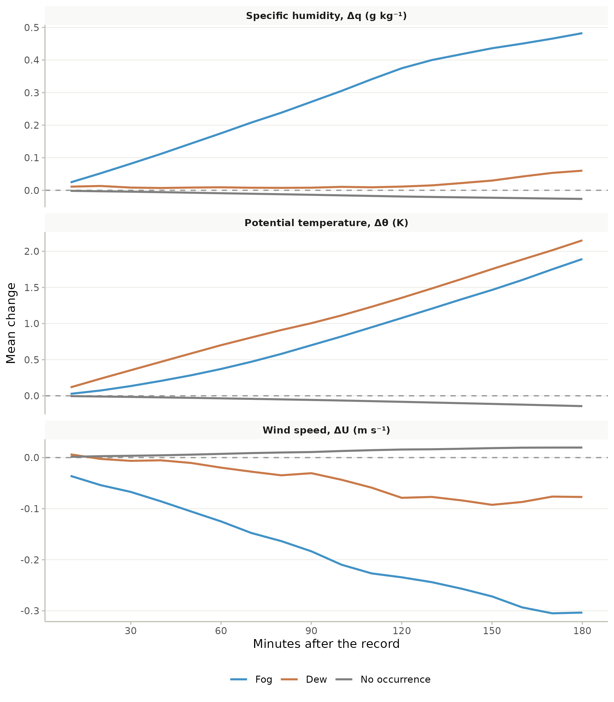
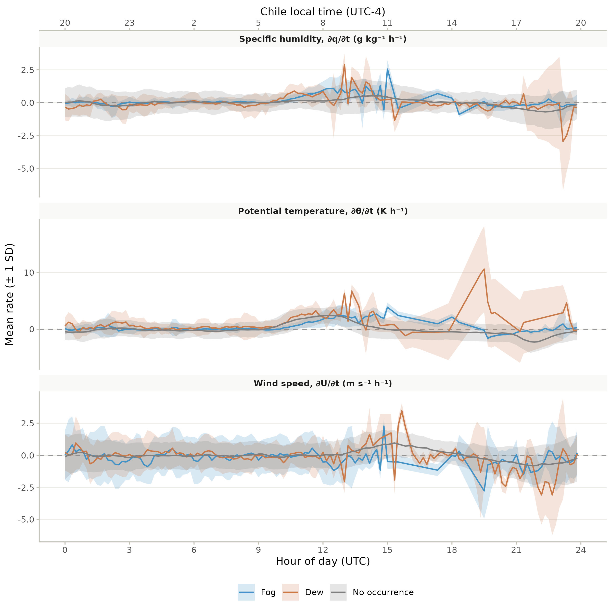
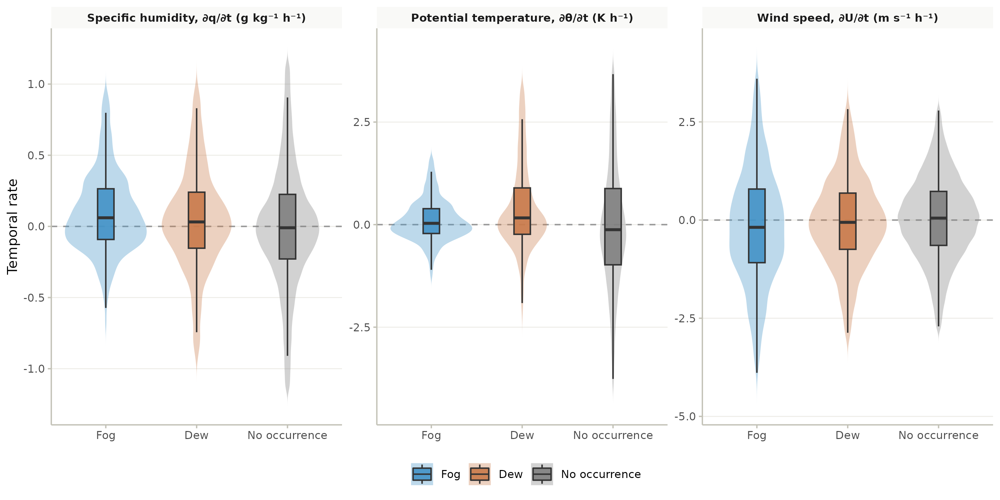
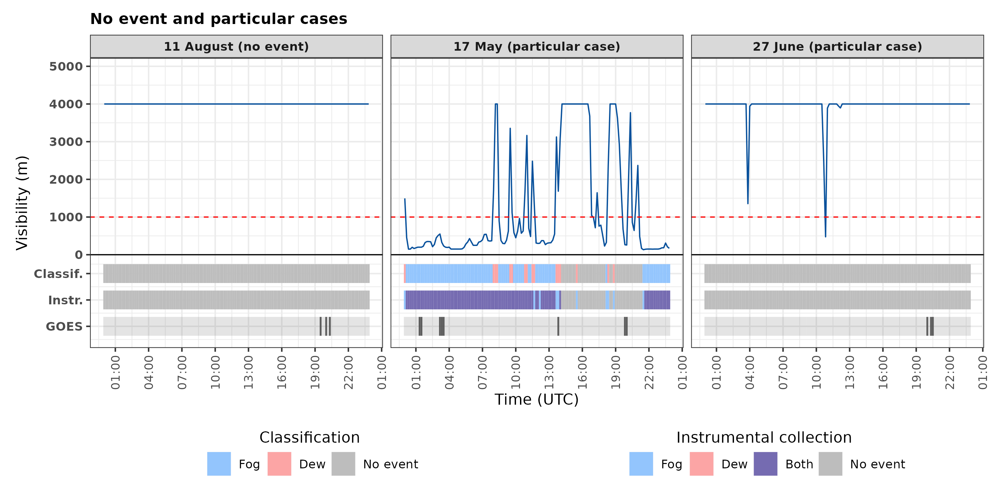

# Introduction

In the coastal Atacama Desert, precipitation is almost null [@Houston2006], thus fog and dew are the main water sources sustaining hyperarid ecosystems and local communities [@LobosRoco2024; @delRo2021b]. In this area *Tillandsia landbeckii* is a classic example of fog dependent vegetation, localized within the fog belt between approximately 900 and 1200 m a.s.l. [@Cereceda2008; @Garca2021], while dew is thought to buffer this species during periods of reduced fog [@Latorre2011; @Jabbusch2025]. Other species share this dependence, including congeneric *Tillandsia* [@Pinto2006] and biological soil crusts [@Jung2019]. Regarding dew specifically, the cactus *Copiapoa cinerea var. haseltoniana* shows differential radiative cooling across its stem and spines, a property exploited in biomimetic dew harvesting designs [@Malik2023], suggesting some desert plants may rely preferentially on this water source. Coastal communities have also used fog water for drinking supply and small scale greenhouse vegetable production [@Fessehaye2014; @Albornoz2023].

Fog and dew are condensation processes that occurs within the marine boundary layer (MBL), governed by turbulent mixing, advection and thermal stratification [@LobosRoco2024; @Stull1988]. Fog forms when a moist air parcel saturates, then reaching the dew point ($T_{air} \leq T_{dew}$) [@Gultepe2007]. In northern Chile, fog results from the advection of marine stratocumulus clouds, which are formed over the South East Pacific (SEP) Ocean under high subsidence promoted by the South Pacific Anticyclone [@RUTLLANT2002; @Cereceda2002; @Cereceda2008]. This subsidence contrasts with the cold Humboldt Current and the cold water upwelling forming a strong thermal inversion (\~20 K) that limits vertical mixing, driving the stratocumulus cloud formation [@Espinoza2024]. The anticyclonic circulation in the SEP transports these well-formed stratocumulus up to 50–60 km inland [@delRo2021b; @LobosRoco2024]. Here, clouds get in contact with the coastal mountain range between 600 and 1200 m asl, forming a fog belt. One of the main thermodynamic characteristic of stratocumulus cloud-fog in the Atacama is that it develops under a well-mixed (turbulent) MBL, with low potential temperature gradients (∂θ/∂z \< 3.1×10⁻³ K m⁻¹) [@LobosRoco2018] and continuous positive moisture advection (∂q/∂t ≈ +0.016 g kg⁻¹ h⁻¹) [@LobosRoco2024].

In contrast, dew forms over surfaces, which driven by nocturnal radiative cooling, reach the dew point ($T_{surf} \leq T_{dew}$), condensing directly on solid surfaces under clear, calm, humid conditions [@Monteith1957; @Jacobs2006]. In terms of thermodynamics, dew forms under a more stable surface layer (∂θ/∂z \> 3.8×10⁻³ K m⁻¹) and a net negative vapour tendency (∂q/∂t ≈ −0.25 g kg⁻¹ h⁻¹) [@LobosRoco2024]. This contrast shows that atmospheric thermal stability is a reliable variable to distinguish between fog and dew, unlike the moisture gradient, which is limited by MBL humidity homogeneity [@LobosRoco2024]. Contrary, since dew formation reduces the air humidity by transferring it to the surface, the ∂q/∂t also might play a role in distinguish dew from fog.

Fog and dew can be quantified by measuring their respective collection rates. For that purpose, standardized passive collectors have been developed. On the one hand, the Standard Fog Collector (SFC), collects fog droplets over a 1 m² polypropylene mesh [@Schemenauer1994]. In the Atacama, fog collects rates from 3 to 8 $L\ m^{-2}\ day^{-1}$ [@Larrain2002; @Cereceda2008]. On the other hand, the Standard Dew Collector (SDC), collects dew by cooling a plate surface of a 1 m² by nocturnal radiative loss [@Muselli2002]. In the Atacama, collection rates of dew fall within the range observed in other arid regions worldwide, from 0.1 to 0.8 L m⁻² day⁻¹ [@LobosRoco2024]. Despite the effort of quantify fog and dew through the passive collection, they fail to distinguish between the two phenomena due to an instrumental overlap in their collection periods, which leaves their relative contribution highly uncertain [@LobosRoco2024].

In hyperarid regions, accurately measuring their dynamics is essential to understanding their contribution to the hydrological cycle and the carbon balance of these ecosystems [@Wang2016]. Both processes provide the moisture upon which biological soil crusts and other surface organisms depend on, directly influencing their carbon-sequestering capacity. This underscores the need for methods that allow for the precise determination of each phenomenon's individual contribution [@Chamizo2021; @Li2025]. In contrast to fog, our understanding of dew remains very limited [@Li2025]. Beyond its ecological significance, this understanding could also benefit local communities by improving water-harvesting technologies and guiding appropriate water management in arid regions.

In the context of the highly uncertainty that fog and dew collectors produces, in this study we aim to distinguish fog from dew by analyzing their atmospheric thermodynamic characteristics. In particular we aim to answer how do atmospheric stability and humidity tendency differ between fog and dew occurrences in the coastal Atacama Desert? We hypothesize that dew collection is systematically underestimated by standard collectors. Likewise fog and dew show marked difference in the atmospheric stability and specific humidity tendency. We test three falsifiable hypotheses. Firstly, (occurrence): the frequency of dew occurrences compared to total occurrences exceeds the ones recorded by SDC. Secondly (structure): fog forms under a well mixed and turbulent marine boundary layer (lower ∂θ/∂z and higher ∂U/∂z), whereas dew forms under a more stratified and calm layer (higher ∂θ/∂z and lower ∂U/∂z), while ∂q/∂z would not allow discrimination between both regimes, since both require a well-mixed vapor column near saturation. Thirdly (dynamics): fog is marked by continuous humidity advection (∂q/∂t \> 0), while dew by a surface humidity sink (∂q/∂t ≤ 0), reflecting opposite atmospheric water vapor tendency. To test these hypothesis, our research strategy was based a combination of in-situ meteorological observations from a topographic transect and satellite information retrieved from GOES satellite. This manuscript is structured as follows. Section 2 describes the study area and the methods used to quantify the variables required to test our three falsifiable hypotheses. In Section 3 we presents our results, which are organized into three sub-sections: (3.1) the occurrence of fog and dew, (3.2) the vertical thermodynamic structure of the boundary layer under each regime, and (3.3) the temporal evolution of specific humidity. Building upon our results, Section 4 discusses these findings in light of the existing literature. Finally, Section 5 offers conclusions and future prospects of this study.

# Outline methods

## Study area: Cerro Oyarbide

The meteorological observations used in this study are located over topographic transect placed at Cerro Oyarbide (\~20.61°S, 70.07°W). This site is located in the Atacama coastal mountain range about 11 km inland from the coastline (@fig-oyarbide, B and D). The climate is hyper-arid, where no rain occurs and the sole water inputs to the surface comes from dew and fog. Such conditions only sustain *Tillandsia landbeckii* species, a rootless plant that locates between 900 and 1200 m above sea level, in the upper border of the fog belt [@Garca2021; @Koch2019]. This site functions as a natural laboratory for studying fog and dew, since the station transect overcome the vertical extent of the marine boundary layer (0 to 1354 m a.s.l), with a continuous topographic gradient of 9 stations crossing exactly the band where regional stratocumulus fog concentrates (@fig-oyarbide, A). This band ranges from a cloud base as low as \~753 m a.s.l. to a cloud top as high as \~1400 m a.s.l. [@delRo2021]. Within this gradient, our main station named OYA1211 located on the upper border of Tillandsia landbeckii fields (@fig-oyarbide, C), allowing direct characterization of the atmosphere-biosphere interaction at the same point where the classification protocol is anchored.

![Overview of the study site at Cerro Oyarbide, Atacama Desert, Chile. (A) Satellite image showing a perspective view of the meteorological station topographic transect on Cerro Oyarbide. The blue line connects the stations along the topographic transect. The dotted line traces the dominant fog advection direction indicated. (B) Topographic profile of the transect showing station elevation (z, m a.s.l.) as a function of cumulative along-transect distance (km), illustrating how the stations are distributed across the vertical extent of the marine boundary layer and the stratocumulus fog band. (C) Photograph of station OYA1211, located at the upper border of the Tillandsia landbeckii fields, showing the main instrumentation setup: the visibility sensor (VIS), surface fog collector (SFC), and standard dew collector (SDC), together with the dominant fog and dew input pathways. Inset shows a detail of the VIS sensor mounted on the station mast.](../figures/fig01_study_site.png){#fig-oyarbide fig-align="center"}

## Data and instrumentation

The dataset used in this study spans the full year 2024 at a 10-minute interval, includes air temperature (°C), relative humidity (%), wind speed (m/s) and direction (°), horizontal visibility (m), air pressure (Pa), and fog and dew collection (mL m⁻²). Data availability varies by station and sensor (@tbl-availability), for example, stations OYA518, OYA780, OYA1128, and OYA1211 maintain almost complete continuity throughout 2024, while station OYA1069 shows critical gaps due to sensor malfunction, including total data loss of temperature and only 16.7% availability in relative humidity and wind direction, which exclude it from most subsequent thermodynamic gradients. Among these stations, OYA1211 is the most fully equipped of the entire transect and including, the standard dew collector (SDC), the standard fog collector (SFC), and the horizontal visibility sensor (@fig-oyarbide, C).

The main observations used in this study are the fog and dew collectors and the visibility sensor. The fog collector (SFC) is a 1 m² standard mesh that intercepts fog droplets (0.2 to 30 μm) advected by the wind. Droplets grow by coalescence and precipitate along the mesh into tipping bucket pluviometer, which measure the water volumes per time [@Schemenauer1994]. The dew collector (SDC) is a 1 m² tilted surface where water vapor condenses once surface temperature drops below the dew point; the water then flows by gravity into a tipping bucket pluviometer [@Muselli2002]. The SFC faces the prevailing fog advection from the ocean (west), the SDC captures vertical condensation toward the surface, and the visibility sensor is aligned perpendicular to the SFC for undisturbed optical measurements.

This ground-based network is further complemented by GOES-16 satellite observations, processed in Google Earth Engine at a spatial resolution of 2 km and synchronized every 10 minutes, which detect fog and low clouds (FLC) using a dual-band brightness temperature threshold algorithm, whose methodology can be found in @delRo2021 and @Espinoza2024. These satellite data is used as a secondary layer and for regional validation of the fog or dew occurrence classification criteria. All data have been processed in R using the tidyverse ecosystem and under version control on GitHub [@MunozNarbona2026].

| Station | Dist (km) | Temp (°C) | HR (%) | U (m/s) | DV (°) | Fog (mL m⁻²) | Pres (hPa) | Vis (m) | Dew (mL m⁻²) |   |
|:------|:-----:|:-----:|:-----:|:-----:|:-----:|:-----:|:-----:|:-----:|:-----:|
| **OYA48 (AERP.)** | 0.86 | 100% | 100% | 100% | 100% | – | 100% | 0% | – |
| **OYA518** | 4.18 | 99% | 99% | 97% | 99% | 99% | 99% | 0% | – |
| **OYA780** | 9.83 | 99% | 99% | 98% | 99% | 99% | 99% | 0% | – |
| **OYA862** | 8.67 | 86% | 91% | 86% | 91% | 9% | 0% | 0% | – |
| **OYA1069** | 10.75 | 0% | 17% | 0% | 17% | 17% | 0% | 0% | – |
| **OYA1128** | 12.92 | 100% | 100% | 100% | 100% | 100% | 0% | 0% | – |
| **OYA1193** | 13.12 | 90% | 92% | 90% | 92% | 92% | 0% | 0% | – |
| **OYA1211** | 13.11 | 100% | 100% | 100% | 100% | 100% | 100% | 93% | 100% |
| **OYA1354** | 11.41 | 83% | 83% | 83% | 83% | 92% | 0% | 0% | – |

: Percentage of data availability (%) for 2024 at a 10-minute temporal resolution across the ground monitoring network. The numeric suffix in each station's name designates its operating altitude (m a.s.l.). Abbreviations: Temp (air temperature), HR (relative humidity), U (wind speed), DV (wind direction), Niebla (surface fog occurrence validation), Pres (atmospheric pressure), Rad (global radiation), Vis (visibility), Rocío (dew collection), Dist (distance to the coastline). Dashes (–) indicate that the variable is not monitored by the station. GOES-16 satellite images maintained 100% availability for low cloud (FLC) detection throughout the entire study period. {#tbl-availability}

## Data Processing

The research strategy has been divided into three specific objectives, associated to each hypothesis: (1) characterize the temporal distribution of fog and dew occurrences and their co-occurrence from visibility and GOES observations; (2) evaluate the atmospheric stability under each occurrence type through potential temperature, specific humidity, and wind speed vertical gradients along the topographic station transect; (3) analyze the tendency on time of humidity, potential temperature and wind speed under fog and dew occurrences.

### OE1: Hierarchical classification of fog and dew occurrences

To achieve the first specific objective, we used two criteria based on visibility and FLC detection, where visibility was the priority. Regardless of whether water is collected by the SFC or the SDC, the occurrence is classified as fog if visibility falls below 1000 m. The occurrence is classified as dew if visibility is equal to or above 1000 m. GOES-16 FLC served as a secondary criterion when visibility is unavailable, given its coarser spatial resolution and vertical uncertainty, since a detected low cloud pixel does not necessarily intersect the topography.

$$\text{Occurrence Type} =
\begin{cases}
\text{fog}, & \text{if visibility} < 1000 \text{ m, or visibility is unavailable and GOES FLC} = 1 \\
\text{dew}, & \text{if visibility} \geq 1000 \text{ m, or visibility is unavailable and GOES FLC} = 0
\end{cases}$$ {#eq-classification}

In addition to the classification algorithm, a manual review is performed. The automatic classification is compared against the visibility curve and the GOES signal. Isolated errors are corrected, and days of atypical behavior are documented. For example, an abrupt drop and recovery of visibility within a short period is likely caused by sensor lens dew condensation, or debris such as dust particles or insects obstructing the sensor rather than an actual fog occurrence, and is reclassified as dew. Likewise, when a continuous occurrence is interrupted by an isolated 10-minute segment classified differently, this segment is corrected to match the surrounding occurrence.

### OE2: Analyse the atmospheric stability through the thermodynamic vertical gradients

After reclassified fog and dew occurrences using the satellite and visibility criteria, we analyse the atmospheric stability of fog and dew reclassified occurrences. For analyzing the atmospheric stability we use two thermodynamic conserved variables of potential temperature (θ), specific humidity (q) and wind speed (U). Potential temperature is calculated as follows:

$$\theta = T \cdot \left(\frac{P_0}{P}\right)^{R/C_p}$$ {#eq-theta}

where T is the absolute air temperature (K), P0 is the pressure (hPa) measured at the lowest station, P is the atmospheric pressure level at every station (hPa), R is the constant gas of dry air (287.08 J kg⁻¹ K⁻¹) and cp is the specific heat of dry air (1004.67 J kg⁻¹ K⁻¹). Specific humidity (q) is approximated using the mixing ratio (r), since in the lower troposphere the water vapor mass is much smaller than the dry air mass and the total pressure greatly exceeds the vapor pressure, so that q ≈ r. 'q' is estimated using the following expression:

$$q \approx r = \epsilon \frac{e}{P - e}$$ {#eq-q}

where ϵ is he ratio of the molecular weight of water vapor to that of dry air (ϵ=0.622 kg kg-1), e is the water vapor pressure (hPa), obtained from relative humidity and saturated vapor pressure.

To calculate the vertical gradients that are used as a proxy of atmospheric stability we used:

$$\frac{\partial \phi}{\partial z} \sim \frac{\Delta \phi}{\Delta z} = \frac{\phi_2 - \phi_1}{z_2 - z_1}, \quad \phi \in \{\theta, q, U\}$$ {#eq-dphi-dz}

where $\phi$ represents the conservative scalar of $\theta$, q or U, z1 the reference altitude level (48 m asl) and z2 the altitude of each station. Both the vertical gradients and the temporal rates presented below correspond, in principle, to partial derivatives; however, given the finite number of observations available, they are approximated here as finite differences (Δ). Vertical gradients ∂φ/∂z are calculated along the 48–1354 m transect in relation to the coastal baseline, to determine the stability of the MBL, with φ ∈ {θ, q, U}.

### OE3: Analyse the temporal tendency of conserved variables

To achieve the third specific objective, we calculated temporal rates ∂φ/∂t using forward finite differences, with φ ∈ {θ, q, U}. Fixed delays ranging from 10 min to 180 min are used to characterize the response to occurrence onset. Differences of 1 hour, with a tolerance of up to 2 hours, are used for the diurnal cycle and annual distribution statistics. This temporal rate operationalizes the third objective, associated with the dynamics hypothesis. All timestamps are processed in UTC (mainland Chile local time = UTC−4).

$$\frac{\partial \phi}{\partial t} \sim \frac{\Delta \phi}{\Delta t} = \frac{\phi_2 - \phi_1}{t_2 - t_1}, \quad \phi \in \{\theta, q, U\}$$ {#eq-dphi-dt}

# Results

The complete observational dataset of the Cerro Oyarbide topographic transect allows us to reclassify the fog and dew occurrences detected by the collectors using visibility and satellite observations (Section 3.1). This reclassification is then analysed through the vertical profiles of the thermodynamic variables (Section 3.2) and their temporal tendency during fog and dew occurrences (Section 3.3).

## Fog and dew occurrences instrumental reclassification

- @fig-classification shows the total atmospheric water collection frequency in relation to the year (top bar) and the contribution of fog and dew occurrences classified by the collectors and reclassified by our visibility criteria. The top bar places the problem in its true magnitude: the active window of atmospheric water occupies only 8.6% of the year (91.4% without occurrences), so each misclassified interval weighs proportionally more than its duration suggests.
- Within this window, direct instrumental detection reports 49.2% fog, 46.8% mixed fog+dew, and only 4.0% dew.
- However, once the visibility is analysed together with the satellite observation of FLC, the reclassification of fog and dew occurrences shifts to 53.3% fog and 46.7% dew. This large change evidences that the collectors overlap in 46.8% of the atmospheric water inputs when those are measured by any of the collectors.
- After the reclassification, the total frequency of fog collection is 4.6% over the year, and dew 4.0%. The fog frequency is in agreement with two observations that are independent of the collectors: the frequency of FLC detected by GOES-16 over the station (4.4% of the 10-min records of 2024) and the frequency of visibility below 1000 m (5.2% of the records with available visibility).
- The instrumental overlap is not isolated noise: once corrected, the fraction of dew time increases one order of magnitude (4.0% → 46.7%).

{#fig-classification fig-align="center" width="100%"}

- To deepen into how the reclassification based on visibility and satellite observations was made, we analyse specific cases. @fig-typical-days shows how our reclassification criteria work for specific days.
- For example, typical fog days occur on 28 April and 21 September. On 28 April, visibility drops from 4000 m to near zero (minimum of 103 m), remaining below 1000 m from 04:40 to 12:00 UTC (00:40 to 08:00 local time, UTC−4). While visibility drops, the GOES satellite indicates the presence of FLC (04:30 to 10:50 UTC) and both collectors (fog and dew) register water collection. This occurrence is classified as fog because visibility remains below 1000 m during the collection period (@eq-classification).
- The second one occurs on 21 September, when visibility also drops below 1000 m (minimum of 218 m) during the collection period, from 04:30 to 13:20 UTC (01:30 to 10:20 local time, UTC−3), and GOES detects FLC from 04:30 to 13:50 UTC. In this case, only the SDC registers water, so the collectors would assign this occurrence to dew, whereas the reclassification assigns it to fog.
- Contrary, typical dew days occur on 24 April and 28 November. On 24 April, visibility remains above 1000 m all day (minimum of 1110 m at 09:20 UTC) and GOES does not detect FLC, while only the SFC registers water from 03:40 to 12:50 UTC (23:40 to 08:50 local time, UTC−4). This occurrence is classified as dew because visibility remains above 1000 m, although the collectors would assign it to fog.
- On 28 November, visibility remains above 3300 m all day and only the SFC registers water from 03:00 to 10:50 UTC (00:00 to 07:50 local time, UTC−3). During this period GOES detects FLC only at 04:00 UTC; since visibility has priority over GOES in the classification criteria, the occurrence is classified as dew.
- Days without occurrences and particular cases (e.g., 17 May, where erratic visibility alternates between fog and dew within the same day) are shown in Appendix A (@fig-particular-cases).

{#fig-typical-days fig-align="center" width="100%"}

- Beyond these specific days, the reclassification also changes the seasonal and diurnal distribution of fog and dew occurrences, both in frequency and in collected water (@fig-distribution).
- In terms of frequency, the SFC records water in 98% to 100% of the atmospheric water records of every month, except August (70%) and September (63%), when the SDC is more frequent (82% and 89%) (@fig-distribution, A and B). After the reclassification, fog is more frequent in seven of twelve months, reaching its maximum in June (83%, although based on only six records), whereas dew is more frequent in January (68%), February (56%), April (51%), July (58%) and November (53%).
- At the daily scale (@fig-distribution, C and D), the classified dew is as frequent as or more frequent than the classified fog between 01:00 and 09:00 UTC (50% to 60%), whereas fog dominates from 10:00 UTC onwards, exceeding 80% at 12:00 and 13:00 UTC and between 20:00 and 23:00 UTC. Between 14:00 and 17:00 UTC atmospheric water records are scarce, so the frequencies in this interval are unstable.
- In terms of collected water (@fig-distribution, bars in A to D), the classified fog mean exceeds the classified dew mean by about one order of magnitude: across months, it ranges from \~13 to \~130 mL, whereas the classified dew mean ranges from \~0.7 to \~21 mL. Over the whole year, the classified fog mean (\~76 mL) is about 16 times the classified dew mean (\~4.6 mL), and dew accounts for only \~5% of the total classified water, despite occupying 46.7% of the active window (@fig-classification).
- Compared with the instrumental detection, the classified fog mean exceeds the instrumental one in ten of twelve months, while the classified dew mean is lower than the instrumental one in nine of twelve months. Note that the classified mean sums the water of both collectors during each record, whereas the instrumental mean only considers the collector of each phenomenon, which partly explains the higher classified fog values.
- At the daily scale (@fig-distribution, C and D), the classified fog mean shows a nocturnal plateau (\~60 to 85 mL between 00:00 and 11:00 UTC) and an afternoon peak of \~280 mL at 20:00 UTC, whereas the nocturnal classified dew values remain between \~3.5 and 8 mL.

![Seasonal and diurnal distribution of fog and dew occurrences at station OYA1211 during 2024, before (instrumental) and after (classified) the classification based on visibility and GOES-16 FLC. (A) Fog and (B) dew monthly distribution; (C) fog and (D) dew hourly distribution. Bars show the mean accumulated water per 10-min record (values \> 0; left axis), in grey for the instrumental detection and in blue (fog) or orange (dew) for the classification. Lines show the frequency as percentage of the 10-min records with atmospheric water (right axis), dashed with open circles for the instrumental detection and solid with filled circles for the classification; instrumental fog and dew include the records in which both collectors registered water. Note the different water scales of each panel. In (C) and (D), the lower axis is in UTC and the upper axis in approximate Chile local time (UTC-3).](../figures/fig04_seasonal_diurnal_distribution.png){#fig-distribution fig-align="center" width="100%"}

## Atmospheric stability under fog and dew occurrences

- Once fog and dew occurrences are reclassified, we evaluate whether they develop under different atmospheric stability, first for two of the typical days shown in @fig-typical-days and then for the whole year.
- @fig-profiles-days shows the vertical profiles of θ, q and U along the transect on 28 April (fog) and 24 April (dew), for the first and last hour of each occurrence and for the first and last hour without atmospheric water of the same day.
- On 28 April, θ increases by only \~2.6 to 2.9 K between 48 and 1211 m a.s.l. during the fog hours (05:00 and 12:00 UTC), compared with \~4.9 to 5.2 K during the hours without occurrence of the same day (00:00 and 23:00 UTC).
- On 24 April, θ increases by \~5.3 to 5.8 K between 48 and 1211 m a.s.l. during the dew hours (08:00 and 11:00 UTC), a slope closer to that of the hours without occurrence of the same day (\~7.3 to 11.3 K) than to the fog profile.
- In contrast, q and U do not show a comparable difference between occurrence types: q remains between \~9 and 10.3 g kg⁻¹ from 48 to 1211 m a.s.l. during both fog and dew hours.
- Above 1211 m a.s.l., all profiles show a sharp increase in θ (\~3 to 9 K) and a decrease in q (to \~2.2 to 5.6 g kg⁻¹) at 1354 m a.s.l., regardless of the occurrence type. The wind is quite unpredictable.

![Vertical profiles of potential temperature (θ), specific humidity (q) and wind speed (U) along the Cerro Oyarbide transect on 28 April 2024 (fog, top) and 24 April 2024 (dew, bottom), the same days shown in @fig-typical-days. For each day, the first (solid line, filled circles) and last (dashed line, open circles) hour of the occurrence and of the period without atmospheric water at OYA1211 are shown: fog at 05:00 and 12:00 UTC and no occurrence at 00:00 and 23:00 UTC on 28 April; dew at 08:00 and 11:00 UTC and no occurrence at 00:00 and 23:00 UTC on 24 April. Colors indicate fog (blue), dew (orange) and no occurrence (grey). Stations are ordered by elevation (vertical spacing not to scale), and the shaded band marks OYA1211. OYA1069 is not shown because it has no valid data in 2024.](../figures/fig05_profiles_typical_days.png){#fig-profiles-days fig-align="center" width="100%"}

- To verify whether this contrast holds at the annual scale, @fig-gradients summarizes the mean vertical gradients between the coastal reference station (48 m a.s.l.) and each station of the transect, for fog, dew and no occurrence during 2024.
- Under fog, ∂θ/∂z remains low from 518 to 1211 m a.s.l. (0.0013 to 0.0032 K m⁻¹), with a mean of 0.0026 K m⁻¹ at OYA1211. Under dew, it is higher at every station (0.0020 to 0.0037 K m⁻¹), with a mean of 0.0034 K m⁻¹ at OYA1211. Under no occurrence, it increases with elevation from 0.0028 K m⁻¹ at 518 m a.s.l. to 0.0094 K m⁻¹ at OYA1211.
- At 518 m a.s.l. the three regimes show similar gradients (0.0019 to 0.0029 K m⁻¹), but from 780 m a.s.l. upward dew lies much closer to fog than to no occurrence: at OYA1211 the dew mean exceeds the fog mean by 0.0008 K m⁻¹, whereas the no-occurrence mean is almost three times the dew mean.
- The fog and dew difference in ∂θ/∂z is statistically significant both at OYA1211 (Mann–Whitney, r = 0.25, p \< 0.001) and along the transect (r = 0.20, p \< 0.001), and the three groups differ globally (Kruskal–Wallis, χ² = 9116.2 at OYA1211 and χ² = 21627.5 along the transect, df = 2, p \< 0.001).
- However, the fog and dew distributions of ∂θ/∂z overlap: at OYA1211, 54% of the fog records are below 0.0026 K m⁻¹ and 31% exceed 0.0031 K m⁻¹, whereas 52% of the dew records exceed 0.0031 K m⁻¹. Used to separate fog from dew, ∂θ/∂z at OYA1211 reaches an area under the ROC curve of 0.64, with an optimal cut-off (Youden index) of 0.0034 K m⁻¹ and an accuracy of 63%.
- The general threshold of 0.0031 K m⁻¹ [@LobosRoco2018] falls between the fog and dew means at OYA1211, while 97% of the no-occurrence records at this station exceed it.
- At 1354 m a.s.l., ∂θ/∂z increases in all regimes (0.0058, 0.0066 and 0.0098 K m⁻¹ for fog, dew and no occurrence, respectively), consistent with the sharp θ increase above 1211 m a.s.l. observed in @fig-profiles-days, due to the thermal inversion above the marine boundary layer.
- Unlike θ, ∂q/∂z barely differs between fog and dew along the transect (e.g., −0.00049 and −0.00033 g kg⁻¹ m⁻¹ at OYA1211), with small effect sizes (r = 0.13 at OYA1211 and r = 0.04 along the transect). Under no occurrence, ∂q/∂z becomes more negative above 862 m a.s.l. (−0.0020 g kg⁻¹ m⁻¹ at OYA1211), so ∂q/∂z separates active occurrences from no occurrence (r = 0.18 at OYA1211) better than fog from dew.
- At OYA1211, only 3.5% of the fog records and 4.9% of the dew records are below the −0.0016 g kg⁻¹ m⁻¹ threshold of @LobosRoco2018, compared with 48% of the no-occurrence records. Averaging both regimes, active occurrences show a mean ∂q/∂z of −0.0004 g kg⁻¹ m⁻¹ at this station. This new value is proposed as a threshold.
- ∂U/∂z is negative at most stations, i.e., wind speed is lower than at the coast and sea level, and does not differ between fog and dew at OYA1211 (p = 0.63, r = 0.02); along the transect the difference is small (r = 0.07). Only at 1354 m a.s.l. does the wind speed exceed that of the coast under fog and dew.
- Overall, ∂θ/∂z is the only gradient that separates fog from dew with a non-trivial effect size, and the three gradients separate active occurrences from no occurrence more clearly than fog from dew.

![Mean vertical gradients of (A) specific humidity (∂q/∂z), (B) potential temperature (∂θ/∂z) and (C) wind speed (∂U/∂z) between the coastal reference station (48 m a.s.l.) and each station of the Cerro Oyarbide transect, for fog (blue), dew (orange) and no occurrence (grey) during 2024. Points show the mean and shaded bars ±1 standard deviation of the 10-min records (hourly for ∂U/∂z, limited by the coastal wind record). Stations are ordered by elevation (vertical spacing not to scale), and the shaded band marks OYA1211, the station where the classification is anchored (n = 2086 fog, 1915 dew and 44187 no-occurrence records for ∂θ/∂z). OYA1069 is not shown because it has no valid temperature or wind data in 2024. The 48 m point is the reference station, where all gradients are zero by definition. In (B), the horizontal axis is limited to 10.2 × 10⁻³ K m⁻¹ to highlight the difference between fog and dew, so the standard deviation bars of no occurrence are partly cut. Dashed vertical lines show the thresholds of @LobosRoco2018 (dark red: 0.0031 K m⁻¹ and −0.0016 g kg⁻¹ m⁻¹), the mean ∂θ/∂z of fog (blue, 0.0026 K m⁻¹) and dew (orange, 0.0034 K m⁻¹) at OYA1211, and the mean ∂q/∂z of active occurrences at OYA1211 (grey, −0.0004 g kg⁻¹ m⁻¹). Gradients are shown in units of 10⁻³.](../figures/fig06_vertical_gradients.png){#fig-gradients fig-align="center" width="100%"}

## Temporal evolution of humidity, heat and wind speed under fog and dew occurrences

{fig-align="center" width="90%"}

- The previous figure answers this question with all three variables simultaneously. Specific humidity behaves in opposite ways in each regime: fog accumulates +0.48 g kg⁻¹ 180 minutes after occurrence onset, a sustained increase consistent with continuous advection of marine moisture, whereas dew reaches only +0.06 g kg⁻¹, close to neutrality rather than the marked drying expected from an active sink.
- Potential temperature also shows a strong contrast: dew exceeds fog at all times (+2.15 versus +1.89 K at 180 min), consistent with an episodic, radiatively forced mechanism rather than a steady advective one.
- Regarding wind, fog decelerates clearly (−0.30 m s⁻¹) as the cloud layer stabilizes the flow, whereas dew remains nearly neutral (−0.08 m s⁻¹), without reconfiguring the background wind field.
- Overall, the sign of the humidity tendency agrees with the prediction for both regimes, although the magnitude of the dew sink is smaller than previously reported for the region: H3 is supported in direction and refined in magnitude, and it is the θ and U signatures (not q alone) that most strongly support the advective-versus-radiative distinction.

\textcolor{red}{*Comentario: las siguientes figuras podrían fusionarse igual quizás*}

{fig-align="center" width="70%"}

{fig-align="center" width="70%"}

- The dew moisture sink is weaker than expected and its θ variability is high, which points to a real but episodic and locally forced mechanism, consistent with the seasonal/diurnal decoupling already shown in the previous figures. \*\*\*duda

## Extra

- All of these thresholds and rates were derived under the 2024 ENSO context (El Niño → neutral transition), so their interannual generalization to other phases remains an explicit open question rather than an implicit assumption.
- Although fog remains the dominant phenomenon in terms of volume (Fig. 6), the ecohydrological relevance of dew rests not on its yield but on its temporal persistence, 46.7% of the active window (Fig. 5), which is ultimately why it merits sustained study despite its modest volumetric contribution.

# Discussion

- The result nonetheless has two limitations that should be acknowledged, although they do not invalidate it: the visibility sensor is itself affected by condensation during dew (a slight drop that never crosses the fog threshold, visible in the dew panels of @fig-typical-days), and the coarser resolution of GOES-16 means that a detected low-cloud pixel does not necessarily intersect the topography.
- This day/night asymmetry is consistent with advection versus radiative cooling mechanisms.
- This repositions the general threshold of Lobos-Roco et al. (2018), 0.0031 K m⁻¹: in this dataset, it falls within the dew range rather than at the boundary between dew and non-occurrence conditions, as previously assumed. That value separated fog from "everything else" without distinguishing, within that remainder, a dew regime in its own right.
- The physical reason is that both phenomena require a nearly saturated, well-mixed vapor column to initiate, so discrimination cannot be based on humidity; only thermal stability separates the regimes. As a secondary result, we also propose an updated Δq/Δz threshold to distinguish active occurrences from non-occurrence conditions (−0.0004 g kg⁻¹ m⁻¹), which refines (without replacing) the primary θ-based criterion.

# Appendix A

{#fig-particular-cases fig-align="center" width="100%"}

# References
