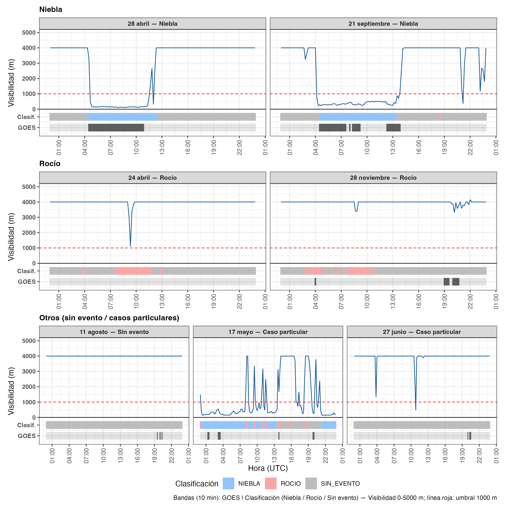
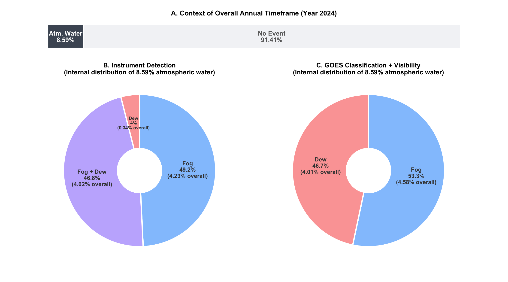
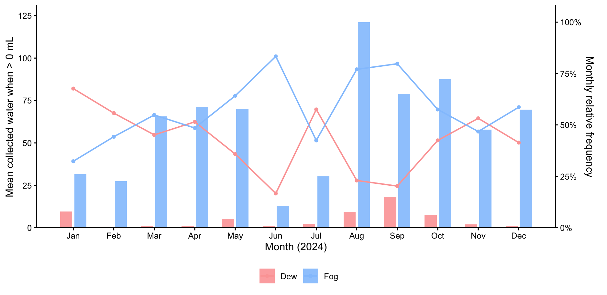
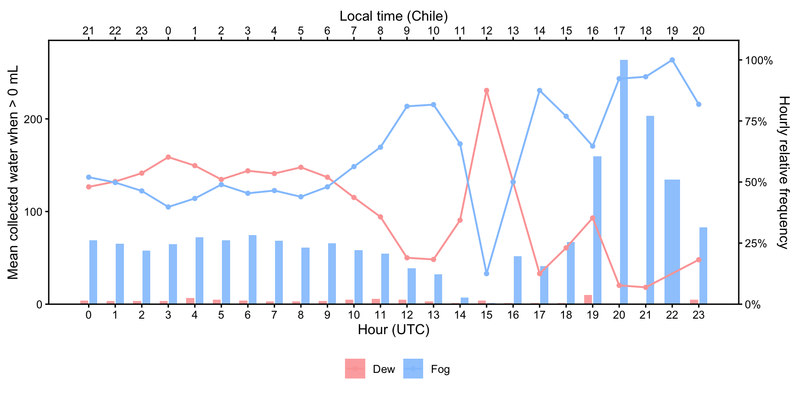
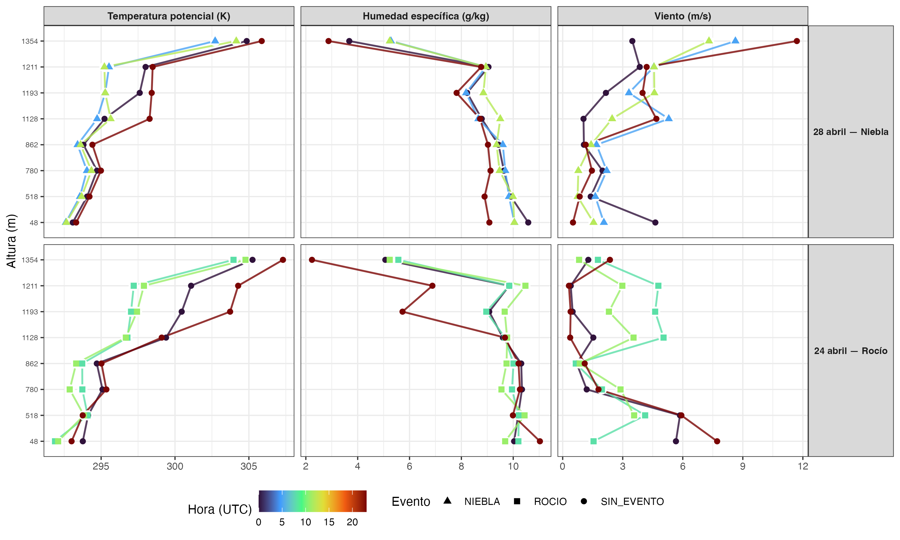
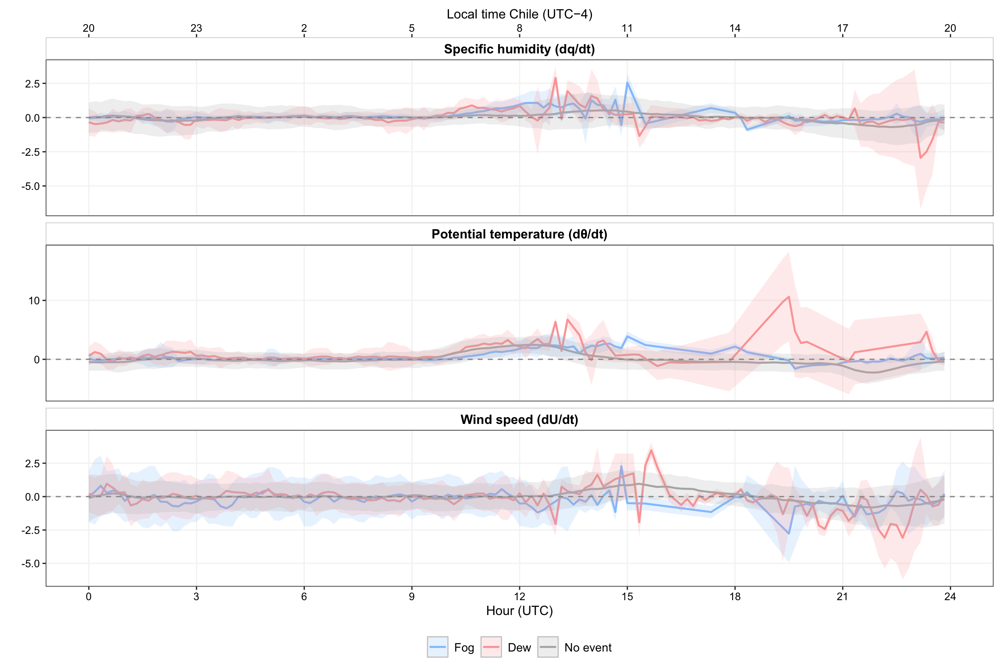
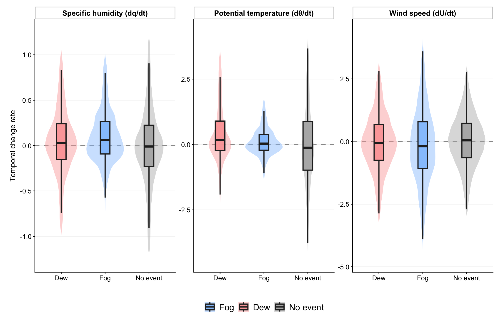

# Introduction

In the coastal Atacama Desert, precipitation is almost null [@Houston2006], thus fog and dew are the main water sources sustaining hyperarid ecosystems and local communities [@LobosRoco2024; @delRo2021b]. In this area *Tillandsia landbeckii* is a classic example of fog dependent vegetation, localized within the fog belt between approximately 900 and 1200 m a.s.l. [@Cereceda2008; @Garca2021], while dew is thought to buffer this species during periods of reduced fog [@Latorre2011; @Jabbusch2025]. Other species share this dependence, including congeneric *Tillandsia* [@Pinto2006] and biological soil crusts [@Jung2019]. Regarding dew specifically, the cactus *Copiapoa cinerea var. haseltoniana* shows differential radiative cooling across its stem and spines, a property exploited in biomimetic dew harvesting designs [@Malik2023], suggesting some desert plants may rely preferentially on this water source. Coastal communities have also used fog water for drinking supply and small scale greenhouse vegetable production [@Fessehaye2014; @Albornoz2023].

Fog and dew are condensation processes that occurs within the marine boundary layer (MBL), governed by turbulent mixing (fog), advection and thermal stratification (dew) [@LobosRoco2024; @Stull1988]. Fog forms when a moist air parcel saturates, then reaching the dew point ($T_{air} \leq T_{dew}$) [@Gultepe2007]. In northern Chile, fog results from the advection of marine stratocumulus clouds, which are formed over the South East Pacific (SEP) Ocean under high subsidence promoted by the South Pacific Anticyclone [@RUTLLANT2002; @Cereceda2002; @Cereceda2008]. This subsidence contrasts with the cold Humboldt Current and the cold water upwelling forming a strong thermal inversion (\~20 K) that limits vertical mixing, driving the stratocumulus cloud formation [@Espinoza2024]. The anticyclonic circulation in the SEP transports these well-formed stratocumulus up to 50–60 km inland [@delRo2021b; @LobosRoco2024]. One of the main thermodynamic characteristic of stratocumulus cloud-fog in the Atacama is that it develops under a well-mixed MBL, with low potential-temperature gradients (∂θ/∂z \< 3.1×10⁻³ K m⁻¹) [@LobosRoco2018] and continuous positive moisture advection (∂q/∂t ≈ +0.016 g kg⁻¹ h⁻¹) [@LobosRoco2024].

In contrast, dew forms over surfaces, which driven by nocturnal radiative cooling, reach the dew point ($T_{surf} \leq T_{dew}$), condensing directly on solid surfaces under clear, calm, humid conditions [@Monteith1957; @Jacobs2006]. In terms of thermodynamics, dew forms under a more stable surface layer (∂θ/∂z ≈ 3.8×10⁻³ K m⁻¹) and a net negative vapour tendency (∂q/∂t ≈ −0.25 g kg⁻¹ h⁻¹) [@LobosRoco2024]. This contrast shows that atmospheric thermal stability is a reliable variable to distinguish between fog and dew, unlike the moisture gradient, which is limited by MBL humidity homogeneity [@LobosRoco2024]. Contrary, since dew formation reduces the air humidity by transferring it to the surface, the ∂q/∂t also might play a role in distinguish dew from fog.

Fog and dew can be quantified by measuring their respective collection rates. For that purpose, standardized passive collectors have been developed. On the one hand, the Standard Fog Collector (SFC), collects fog droplets over a 1 m² polypropylene mesh [@Schemenauer1994]. In the Atacama, fog collects rates from 3 to 8 $L\ m^{-2}\ day^{-1}$  [@Larrain2002; @Cereceda2008]. On the other hand, the Standard Dew Collector (SDC), collects dew by cooling a plate surface of a 1 m² by nocturnal radiative loss [@Muselli2002]. In the Atacama, collection rates of dew fall within the range observed in other arid regions worldwide, from 0.1 to 0.8 L m⁻² day⁻¹ [@LobosRoco2024]. Despite the effort of quantify fog and dew through the passive collection, they fail to distinguish between the two phenomena due to an instrumental overlap in their collection periods, which leaves their relative contribution highly uncertain [@LobosRoco2024].

In hyperarid regions, accurately measuring their dynamics is essential to understanding their contribution to the hydrological cycle and the carbon balance of these ecosystems [@Wang2016]. Both processes provide the moisture upon which biological soil crusts and other surface organisms depend, directly influencing their carbon-sequestering capacity. This underscores the need for methods that allow for the precise determination of each phenomenon's individual contribution [@Chamizo2021; @Li2025]. In contrast to fog, our understanding of dew remains very limited [@Li2025]. Beyond its ecological significance, this understanding could also benefit local communities by improving water-harvesting technologies and guiding appropriate water management in arid regions.

In the context of the highly uncertainty that fog and dew collectors produces, in this study we aim to distinguish fog from dew by analyzing their atmospheric thermodynamic characteristics. In particular we aim to answer how do atmospheric stability and humidity tendency differ between fog and dew eventsin the coastal Atacama Desert? We hypothesize that dew collection is systematically underestimated by standard collectors. Likewise fog and dew show marked difference in the atmospheric stability and specific humidity tendency. We test three falsifiable hypotheses. Firstly, (occurrence): the frequency of dew events compared to total events exceeds the ones recorded by SDC. Secondly (structure): fog forms under a well mixed and turbulent marine boundary layer (lower ∂θ/∂z and higher ∂U/∂z), whereas dew forms under a more stratified and calm layer (higher ∂θ/∂z and lower ∂U/∂z), while ∂q/∂z would not allow discrimination between both regimes, since both require a well-mixed vapor column near saturation. Thirdly (dynamics): fog is marked by continuous humidity advection (∂q/∂t \> 0), while dew by a surface humidity sink (∂q/∂t ≤ 0), reflecting opposite atmospheric water vapor tendency. To test these hypothesis, our research strategy was based a combination of in-situ meteorological observations from a topographic transect and satellite information retrieved from GOES satellite. This manuscript is structured as follows. Section 2 describes the study area and the methods used to quantify the variables required to test our three falsifiable hypotheses. In Section 3 we presents our results, which are organized into three sub-sections: (3.1) the occurrence of fog and dew events, (3.2) the vertical thermodynamic structure of the boundary layer under each regime, and (3.3) the temporal evolution of specific humidity. Building upon our results, Section 4 discusses these findings in light of the existing literature. Finally, Section 5 offers conclusions and future prospects of this study.

# Outline methods

## Study area: Cerro Oyarbide

The meteorological observations used in this study are located over topographic transect placed at Cerro Oyarbide (~20.61°S, 70.07°W). This site is located in the Atacama coastal mountain range about 11 km inland from the coastline (@fig-oyarbide, B and D). The climate is hyper-arid, where no rain occurs and the sole water inputs to the surface comes from dew and fog. Such conditions only allow the development of *Tillandsia landbeckii* species, a rootless plant that locates between 900 and 1200 m above sea level. This site functions as a natural laboratory for studying fog and dew, since the station transect overcome the vertical extent of the marine boundary layer (0 to 1354 m a.s.l), with a continuous topographic gradient of 9 stations crossing exactly the band where regional stratocumulus fog concentrates (@fig-oyarbide, A). This band ranges from a cloud base as low as ~753 m a.s.l. to a cloud top as high as ~1400 m a.s.l. (@delRo2021). Within this gradient, our main station named OYA1211 located on the upper border of Tillandsia landbeckii fields (@fig-oyarbide, C), allowing direct characterization of the atmosphere-biosphere interaction at the same point where the classification protocol is anchored. 

![Overview of the study site at Cerro Oyarbide, Atacama Desert, Chile. (A) Satellite image showing a perspective view of the meteorological station topographic transect on Cerro Oyarbide. The blue line connects the stations along the topographic transect. The dotted line traces the dominant fog advection direction indicated. (B) Topographic profile of the transect showing station elevation (z, m a.s.l.) as a function of cumulative along-transect distance (km), illustrating how the stations are distributed across the vertical extent of the marine boundary layer and the stratocumulus fog band. (C) Photograph of station OYA1211, located at the upper border of the Tillandsia landbeckii fields, showing the main instrumentation setup: the visibility sensor (VIS), surface fog collector (SFC), and standard dew collector (SDC), together with the dominant fog and dew input pathways. Inset shows a detail of the VIS sensor mounted on the station mast. (D) Location of the study area within the South American continent, with the red marker indicating the region of interest along the northern Chilean coast.](figuras/foto_fig02_v06.png){#fig-oyarbide fig-align="center"}

## Data and instrumentation

The dataset used in this study spans the full year 2024 at a 10-minute interval, includes air temperature (°C), relative humidity (%), wind speed (m/s) and direction (°), horizontal visibility (m), air pressure (Pa), and fog and dew collection (mL/m²). Data availability varies by station and sensor (@tbl-availability), for example, stations OYA518, OYA780, OYA1128, and OYA1211 maintain almost complete continuity throughout 2024, while station OYA1069 shows critical gaps due to sensor malfunction, including total data loss of temperature and only 16.7% availability in relative humidity and wind direction, which exclude it from most subsequent thermodynamic gradients. Among these stations, OYA1211 is the most fully equipped of the entire transect and including, the standard dew collector (SDC), the standard fog collector (SFC), and the horizontal visibility sensor (@fig-oyarbide, C).

The main observations used in this study are the fog and dew collectors and the visibility sensor. The fog collector (SFC) is a 1 m² standard mesh that intercepts fog droplets (0.2 to 30 μm) advected by the wind. Droplets grow by coalescence and precipitate along the mesh into tipping bucket pluviometer, which measure the water volumes per time [@Schemenauer1994]. The dew collector (SDC) is a 1 m² tilted surface where water vapor condenses once surface temperature drops below the dew point; the water then flows by gravity into a tipping bucket pluviometer [@Muselli2002]. The SFC faces the prevailing fog advection from the ocean, the SDC captures vertical condensation toward the surface, and the visibility sensor is aligned perpendicular to the SFC for undisturbed optical measurements. *Tillandsia landbeckii* patches surround the instrumentation in the foreground (@fig-oyarbide, C).

This ground-based network is further complemented by GOES-16 satellite observations, processed in Google Earth Engine at a spatial resolution of 2 km and synchronized every 10 minutes, which detect fog and low clouds (FLC) using a dual-band brightness temperature threshold algorithm, whose methodology can be found in @delRo2021 and @Espinoza2024. These satellite data is used as a secondary layer and for regional validation of the fog or dew event classification criteria. All data have been processed in R using the tidyverse ecosystem and under version control on GitHub [@MunozNarbona2026]. 

: Percentage of data availability (%) for 2024 at a 10-minute temporal resolution across the ground monitoring network. The numeric suffix in each station's name designates its operating altitude (m a.s.l.). Abbreviations: Temp (air temperature), HR (relative humidity), U (wind speed), DV (wind direction), Niebla (surface fog event validation), Pres (atmospheric pressure), Rad (global radiation), Vis (visibility), Rocío (dew collection), Dist (distance to the coastline). Dashes (–) indicate that the variable is not monitored by the station. GOES-16 satellite images maintained 100% availability for low cloud (FLC) detection throughout the entire study period. {#tbl-availability}

| Station | Dist (km) | Temp (°C) | HR (%) | U (m/s) | DV (°) | Fog (mm) | Pres (hPa) | Vis (m) | Dew (mm) |
|:-------|:------:|:------:|:------:|:------:|:------:|:------:|:------:|:------:|:------:|:------:|
| **AEROP.** | 0.86 | 100% | 100% | 100% | 100% | – | 100% | 0% | – |
| **OYA518** | 4.18 | 99% | 99% | 97% | 99% | 99% | 99% | 0% | – |
| **OYA780** | 9.83 | 99% | 99% | 98% | 99% | 99% | 99% | 0% | – |
| **OYA862** | 8.67 | 86% | 91% | 86% | 91% | 9% | 0%  | 0% | – |
| **OYA1069** | 10.75 | 0% | 17% | 0% | 17% | 17% | 0% | 0% | – |
| **OYA1128** | 12.92 | 100% | 100% | 100% | 100% | 100% | 0% | 0% | – |
| **OYA1193** | 13.12 | 90% | 92% | 90% | 92% | 92% | 0% | 0% | – |
| **OYA1211** | 13.11 | 100% | 100% | 100% | 100% | 100% | 100% | 93% | 100% |
| **OYA1354** | 11.41 | 83% | 83% | 83% | 83% | 92% | 0% | 0% | – |

## Data Processing

The research strategy has been divided into three specific objectives, associated to each hypothesis: (1) characterize the temporal distribution of fog and dew events and their co-occurrence from visibility and GOES records; (2) evaluate the atmospheric stability under each event type through potential temperature, specific humidity, and wind speed vertical gradients reconstructed along the topographic station transect; (3) analyze the tendency of humidity, potential temperature and wind speed associated with each event through the temporal evolution of specific humidity, quantifying tendencies that distinguish their dynamic origin..

### OE1: Hierarchical classification of fog and dew events

To achieve the first specific objective, we used two criteria based on visibility and FLC detection, where visibility was the priority. Regardless of whether water is collected by the SFC or the SDC, the event is classified as fog if visibility falls below 1000 m. The event is classified as dew if visibility is equal to or above 1000 m. GOES-16 FLC served as a secondary criterion when visibility is unavailable, given its coarser spatial resolution and vertical uncertainty, since a detected low cloud pixel does not necessarily intersect the topography.

$$
\text{Event Type} =
\begin{cases}
\text{fog}, & \text{if visibility} < 1000 \text{ m, or Visibility is unavailable and GOES FLC} = 1 \\
\text{dew}, & \text{if visibility} \geq 1000 \text{ m, or Visibility is unavailable and GOES FLC} = 0
\end{cases}
$$ {#eq-classification}

In addition to the classification algorithm, a manual review is performed for each day of 2024. The automatic classification is compared against the visibility curve and the GOES signal. Isolated errors are corrected, and days of atypical behavior are documented. For example, an abrupt drop and recovery of visibility within a short period is likely caused by sensor len dew condensation, or debris rather than an actual fog event, and is reclassified as dew. Likewise, when a continuous event is interrupted by an isolated 10-minute segment classified differently, this segment is corrected to match the surrounding event.

### OE2: Calculation of thermodynamic gradients

After reclassified fog and dew events using the satellite and visibility criteria, we analyse the atmospheric stability of fog and dew reclassified event. For analyzing the atmospheric stability we use two thermodynamic conserved variables of potential temperature (θ) and specific humidity (q). Potential temperature is calculated as follows:

$$
\theta = T \cdot \left(\frac{P_0}{P}\right)^{R/C_p}
$$ {#eq-theta}

where T is the absolute air temperature (K), P0 is the pressure (hPa) measured at the lowest station,P is the pressure level at every station (hPa), R is the constant gas of dry air (287.08 J kg⁻¹ K⁻¹) and cp is the specific heat of dry air (1004.67 J kg⁻¹ K⁻¹). Specific humidity (q) is approximated using the mixing ratio (r), since in the lower troposphere the water vapor mass is much smaller than the dry air mass and the total pressure greatly exceeds the vapor pressure, so that q ≈ r. 'q' is estimated using the following expression:

$$
q \approx r = \epsilon \frac{e}{P - e}
$$ {#eq-q}

where ϵ is he ratio of the molecular weight of water vapor to that of dry air (ϵ=0.622 kg kg-1), e is the water vapor pressure (hPa), obtained from relative humidity, and P (hPa) is the atmospheric pressure.

To calculate the vertical gradients that ae used as a proxy of atmospheric stability we used:

$$
\frac{\partial \phi}{\partial z} \sim \frac{\Delta \phi}{\Delta z} = \frac{\phi_2 - \phi_1}{z_2 - z_1}, \quad \phi \in \{\theta, q, U\}
$$ {#eq-dphi-dz}

where $\phi$ represents the conservative scalar of $\theta$, q or U, z1 the reference altitude level (48 m asl) and z2 the altitude of each station. Both the vertical gradients and the temporal rates presented below correspond, in principle, to partial derivatives; however, given the finite number of observations available, they are approximated here as finite differences (Δ). Vertical gradients Δφ/Δz are calculated along the 48–1354 m transect in relation to the coastal baseline, to determine the stability of the MBL, with φ ∈ {θ, q, U}, where subfix 1 correspond to the reference lowest station.

### OE3: Calculation of temporal rates

To achieve the third specific objective, we calculated temporal rates Δφ/Δt using forward finite differences, with φ ∈ {θ, q, U}. Fixed delays ranging from 10 min to 180 min are used to characterize the response to event onset. Differences of 1 hour, with a tolerance of up to 2 hours, are used for the diurnal cycle and annual distribution statistics. This temporal rate operationalizes the third objective, associated with the dynamics hypothesis. All timestamps are processed in UTC (mainland Chile local time = UTC−4).

$$
\frac{\partial \phi}{\partial t} \sim \frac{\Delta \phi}{\Delta t} = \frac{\phi_2 - \phi_1}{t_2 - t_1}, \quad \phi \in \{\theta, q, U\}
$$ {#eq-dphi-dt}

# Outline results/discussion

## Event classification

{fig-align="center" width="100%"}

\textcolor{red}{*Comentario: Creo que esta figura anterior debiese sumarle las barritas de los captadores iniciales, solo instrumental, para que se note la diferencia de lo que captó. Esta figura puede ser readaptada igual o quizás si es muy específica no ponerla, pero considero que igual es útil para entender mejor, quizás una figura conjunta con los perfiles verticales de estos mismos días.*}

- Fig. 4 shows daily examples of the mechanism that motivates this entire section. On two days of unambiguous fog and two of unambiguous dew, visibility, the GOES FLC band, and the final classification clearly agree; on a day without events, there is no signal at all; and in one particular case (17 May), erratic visibility alternates between fog and dew within the same day.
- Importantly, on several of these days, the SDC or the SFC records water on days that the independent classifier assigns to the *opposite* phenomenon; this is the raw instrumental overlap, visible case by case before it is aggregated at the annual scale.\textcolor{red}{*esto anterior es a lo que me refiero que debiese sumar barritas horizontales*}

{fig-align="center" width="100%"}

- Fig. 5 (above) aggregates precisely this across the whole of 2024. Its top bar first places the problem in its true magnitude: the active window of atmospheric water occupies only 8.6% of the year (91.4% without events), so each misclassified interval weighs proportionally more than its duration suggests.
- Within this window, direct instrumental detection reports 49.2% fog, 46.8% mixed fog+dew, and only 4.0% pure dew; when this criterion is replaced by the Visibility+GOES classification (binary by design), the partition shifts to 53.3% fog and 46.7% pure dew.
- In other words, the instrumental overlap is not isolated noise: once corrected, the fraction of pure dew time increases more than tenfold (4.0% → 46.7%). H1 is thus supported, and this is the central quantitative result of the paper, from which all subsequent figures follow.
- The result nonetheless has two limitations that should be acknowledged, although they do not invalidate it: the visibility sensor is itself affected by condensation during dew (a slight drop that never crosses the fog threshold, visible in the dew panels of Fig. 4), and the coarser resolution of GOES-16 means that a detected low-cloud pixel does not necessarily intersect the topography.

## Distribución estacional y diurna de los eventos reclasificados

\textcolor{red}{*quizás se podrían pegar estas dos figuras en una?*}

{fig-align="center" width="90%"}

- This figure shows that mean fog collection exceeds mean dew collection in all twelve months of the year, with August–October concentrating the maximum volumes of both phenomena.
- However, magnitude and frequency do not always coincide: in June, fog dominates in frequency without yielding much per event, whereas in August–September dew is comparatively infrequent yet episodically intense, a first indication that counting events and summing the volume they yield are two distinct questions, to which we return below.

{fig-align="center" width="90%"}

- The same dissociation recurs at the daily scale in the figure: dew maintains its most stable regime between 21:00 and 09:00 local time (00:00–12:00 UTC), with a high and constant relative frequency that exceeds that of fog within this window.
- Fog, in contrast, dominates between 09:00 and 20:00 local time in both frequency and collected volume, peaking near 20:00 UTC (~300 mL per 10-min interval), a day/night asymmetry consistent with advection versus radiative cooling mechanisms.
- An isolated spike at 15:00 UTC (12:00 local time) reflects a low sample size in that interval rather than a genuine physical signal.

## Estructura termodinámica vertical de la capa límite

\textcolor{red}{*Comentario: esta figura diaria siguiente es la que podría fusionarse con la que pongo dias de ejemplo más arriba, en la clasificación vis+goes*}

{fig-align="center" width="100%"}

- At the scale of a single day, the previous figure already reveals the pattern: 28 April (fog) exhibits a nearly uniform θ profile between 48 and 1354 m a.s.l. (the signature of a well-mixed layer), whereas 24 April (dew) shows a vertical gradient similar to that of the non-event hours of the same day. The q and U profiles, however, show no equivalent contrast between the two regimes.

{fig-align="center" width="100%"}

- The previous figure generalizes this pattern to the eight stations of the transect throughout 2024: fog is concentrated at Δθ/Δz < 0.0026 K m⁻¹, dew at 0.0026–0.0034 K m⁻¹, and non-event conditions jump to ≈ 0.0094 K m⁻¹, yielding three distinct regimes.
- Mann–Whitney/Kruskal–Wallis tests confirm that this contrast is robust for θ (r = 0.25, p < 0.001), but not for q or U (r ≈ 0.04–0.13); H2 is therefore fully supported, including its negative prediction.
- This repositions the general threshold of Lobos-Roco et al. (2018), 0.0031 K m⁻¹: in this dataset, it falls within the dew range rather than at the boundary between dew and non-event conditions, as previously assumed. That value separated fog from "everything else" without distinguishing, within that remainder, a dew regime in its own right.
- The physical reason is that both phenomena require a nearly saturated, well-mixed vapor column to initiate, so discrimination cannot be based on humidity; only thermal stability separates the regimes. As a secondary result, we also propose an updated Δq/Δz threshold to distinguish active events from non-event conditions (−0.0004 g kg⁻¹ m⁻¹), which refines (without replacing) the primary θ-based criterion.

## Evolución temporal y firmas de flujo de humedad/calor

{fig-align="center" width="90%"}

- The previous figure answers this question with all three variables simultaneously. Specific humidity behaves in opposite ways in each regime: fog accumulates +0.48 g kg⁻¹ 180 minutes after event onset, a sustained increase consistent with continuous advection of marine moisture, whereas dew reaches only +0.06 g kg⁻¹, close to neutrality rather than the marked drying expected from an active sink.
- Potential temperature also shows a strong contrast: dew exceeds fog at all times (+2.15 versus +1.89 K at 180 min), consistent with an episodic, radiatively forced mechanism rather than a steady advective one.
- Regarding wind, fog decelerates clearly (−0.30 m s⁻¹) as the cloud layer stabilizes the flow, whereas dew remains nearly neutral (−0.08 m s⁻¹), without reconfiguring the background wind field.
- Overall, the sign of the humidity tendency agrees with the prediction for both regimes, although the magnitude of the dew sink is smaller than previously reported for the region: H3 is supported in direction and refined in magnitude, and it is the θ and U signatures (not q alone) that most strongly support the advective-versus-radiative distinction.

\textcolor{red}{*Comentario: las siguientes figuras podrían fusionarse igual quizás*}

{fig-align="center" width="70%"}

{fig-align="center" width="70%"}

- The dew moisture sink is weaker than expected and its θ variability is high, which points to a real but episodic and locally forced mechanism, consistent with the seasonal/diurnal decoupling already shown in the previous figures. ***duda

## Extra

- All of these thresholds and rates were derived under the 2024 ENSO context (El Niño → neutral transition), so their interannual generalization to other phases remains an explicit open question rather than an implicit assumption.
- Although fog remains the dominant phenomenon in terms of volume (Fig. 6), the ecohydrological relevance of dew rests not on its yield but on its temporal persistence, 46.7% of the active window (Fig. 5), which is ultimately why it merits sustained study despite its modest volumetric contribution.

# References
