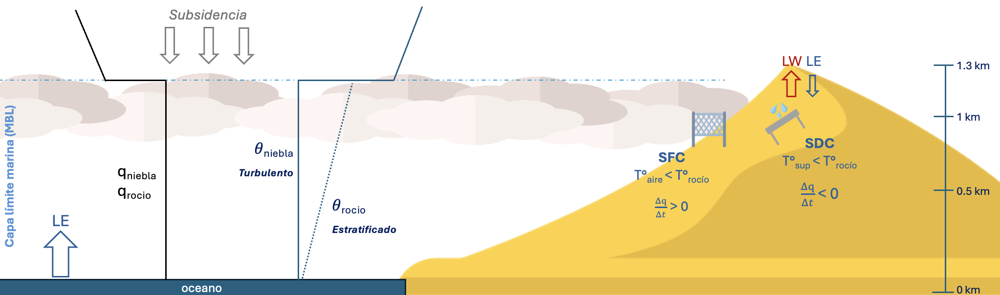
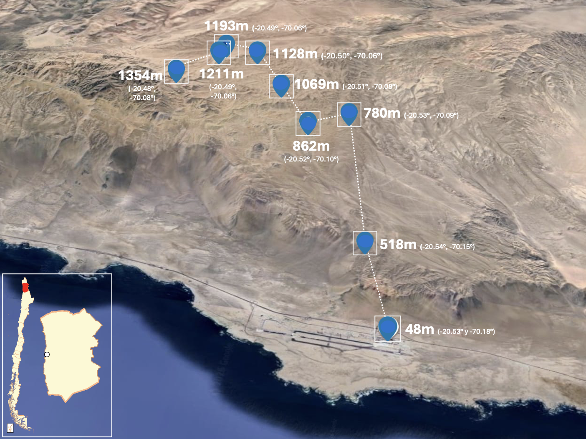
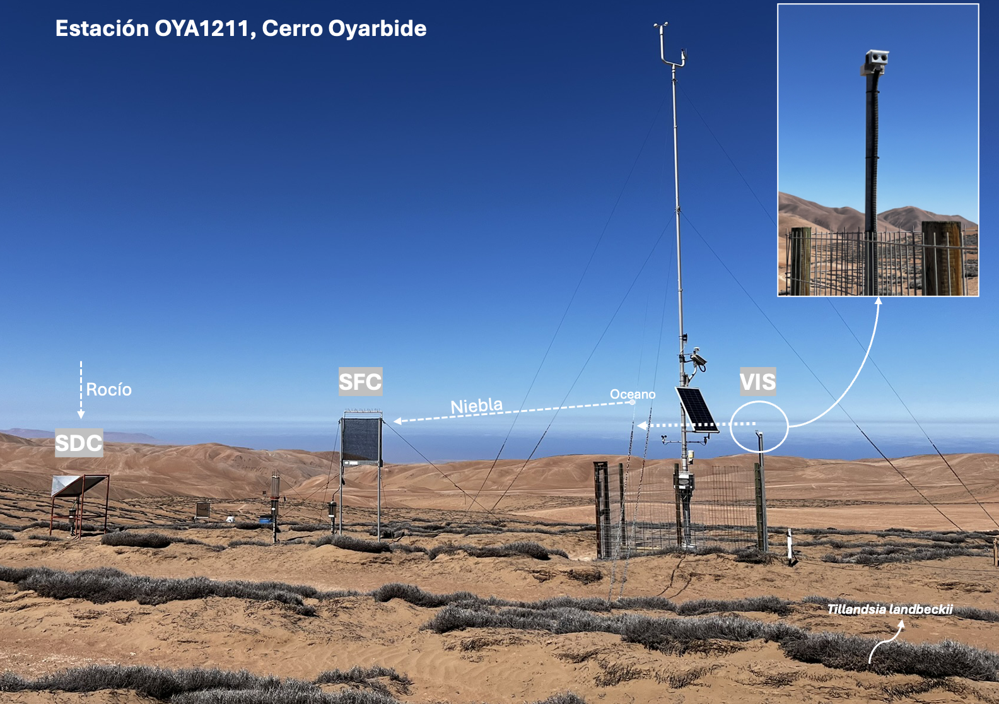

# Introducción

In the coastal Atacama Desert, precipitation is almost null [@Houston2006]; thus, fog and dew are the main water sources that sustanin fragile hyperarid ecosystems such as Tillandsia lancdbeckii and potentially provide a freshwater supply to local communities [@delRo2021b; @LobosRoco2024].
Fog and dew are condensation processes within the atmospheric boundary layer (ABL), governed by turbulent mixing, advection and thermal stratification [@Stull1988; @LobosRoco2024]. Fog forms when air saturates at the surface (T_air ≤ T_dew) [@Gultepe2007]; in northern Chile it results from the advection of marine stratocumulus sustained by the cold Humboldt Current and subsidence from the South Pacific Anticyclone [@RUTLLANT2002; @Cereceda2002; @Cereceda2008]. This generates a strong thermal inversion (Δθ ≈ 20 K) that limits vertical mixing and drives inland moisture transport via the sea breeze, within 500–1200 m a.s.l. and up to 50–60 km inland [@delRo2021b; @LobosRoco2018; @LobosRoco2024]. Fog develops under a well-mixed MBL, with low potential-temperature gradients (∂θ/∂z < 3.1×10⁻³ K m⁻¹) [@LobosRoco2018] and continuous positive moisture advection (Δq/Δt ≈ +0.016 g kg⁻¹ h⁻¹; @LobosRoco2024). Dew instead forms by nocturnal radiative cooling below the dew point at the surface (T_surf ≤ T_dew), condensing directly on solid surfaces under clear, calm, humid conditions [@Monteith1957], within a more stable layer (∂θ/∂z ≈ 3.8×10⁻³ K m⁻¹) and net downward vapor flux (Δq/Δt ≈ −0.25 g kg⁻¹ h⁻¹) [@LobosRoco2024]. This contrast shows that ∂θ/∂z is a robust discriminator between fog and dew, unlike the moisture gradient, which is limited by MBL humidity homogeneity [@LobosRoco2024]. Existing indicators (visibility, satellite low clouds) validate fog versus non-fog but not their overlap with dew [@delRo2021b; @KeimVera2024], a gap this study addresses.
To measure fog and dew, standardised passive devices have been developed: a Standard Fog Collector (SFC), which collects fog through a 1 m² polypropylene mesh [@Schemenauer1994], and a Standard Dew Collector (SDC), which collects dew by radiative cooling of a 1 m² condensing plate [@Muselli2002]. However, fog and dew collectors fail to distinguish between the two phenomena due to an instrumental overlap in their collection periods, which leaves their relative contribution highly uncertain [@LobosRoco2024].
In semi-arid regions, where fog and dew constitute the primary water inputs sustaining ecosystems, accurately measuring their dynamics is essential to understanding their role in the water and carbon balance of these systems [@Wang2016; @LobosRoco2024]. Both processes supply moisture that biological soil crusts and other surface-dwelling organisms rely on, directly influencing their carbon fixation capacity, which underscores the need for measurement approaches capable of properly constraining the individual contribution of each phenomenon [@Chamizo2021; @Li2025].
To measure fog and dew, standardised passive collectors have been developed: the Standard Fog Collector (SFC), which collects the amount of fog through a 1 m² polypropylene mesh [@Schemenauer1994], and a Standard Dew Collector (SDC), which collects dew by radiative cooling of a 1 m² condensing plate [@Muselli2002]. However, fog and dew collectors fail to distinguish between the two phenomena due to an instrumental overlap in their collection periods, which leaves their relative contribution highly uncertain [@LobosRoco2024]. Knowledge of dew remains comparatively limited relative to fog [@Li2025], and resolving this ambiguity is important not only to understand hyperarid ecosystem hydrology, but also to develop improved collection technologies and inform water-related public policy in arid regions.
We hypothesise that dew events are systematically underestimated by standard collectors, and that fog and dew differ markedly in atmospheric thermodynamics and advection. We therefore ask: how do atmospheric thermodynamics and surface–atmosphere coupling differ between fog and dew along the altitudinal transect of the coastal Atacama Desert? We test three falsifiable hypotheses. H1 (occurrence): the true proportion of dew events exceeds that recorded by collectors. H2 (structure): fog forms under a well-mixed marine boundary layer (lower ∂θ/∂z), dew under a more stratified layer (higher ∂θ/∂z), while ∂q/∂z and ∂U/∂z do not discriminate between regimes, as both require a near-saturated, well-mixed vapour column. H3 (dynamics): fog is marked by continuous moisture advection (∂q/∂t > 0), dew by a surface moisture sink (∂q/∂t ≤ 0), reflecting opposite latent heat flux directions.

- En el Desierto de Atacama costero, las precipitaciones son muy bajas, así que la niebla y el rocío son las principales fuentes de agua que sostienen los ecosistemas hiperáridos de *Tillandsia landbeckii* (y otras especies) y que complementan el abastecimiento hídrico de las comunidades locales.
- Los colectores mecánicos estándar (SFC para niebla, SDC para rocío) no logran separar ambos fenómenos, hay solapamiento instrumental entre colectores, que deja su aporte relativo con una gran incertidumbre. Un colector de niebla puede generar rocío en cualquiera de sus estructuras, y un captador de rocío puede captar deposición de niebla.
- El conocomiento del rocío es limitado y es importante estudiarlo más y diferenciarlo de la niebla, para comprender la hidrología del ecosistema y también para desarrollar mejores tecnología de captación para las comunidades, permitiendo el desarrollo de mejores políticas públicas asociadas al agua en regiones áridas.
- Existe una alternativa para diferenciar niebla y rocío. Hay algunos estudios sobre umbrales de estabilidad regionales (Δ$\theta$/Δz), los cuales se han calibrado exclusivamente para separar "niebla" de "no-niebla"; el rocío no ha sido tratado como un régimen termodinámico independiente aún.
- Pregunta de investigación: ¿Cómo difieren la termodinámica atmosférica y el acoplamiento superficie-atmósfera entre eventos de niebla y rocío a lo largo de la transecta altitudinal del desierto costero de atacama?
- Hipótesis, planteadas como predicciones falsables:
  - *H1 (ocurrencia).* El porcentaje real de eventos de rocío supera de forma significativa al indicado por el registro de los colectores.
  - *H2 (estructura).* La niebla corresponde a una capa límite marina más mezclada (menor Δ$\theta$/Δz); el rocío a una capa más estratificada (mayor Δθ/Δz). Se predice que Δq/Δz y ΔU/Δz no discriminan entre regímenes, ya que ambos fenómenos requieren una columna de vapor casi saturada y bien mezclada para formarse.
  - *H3 (dinámica).* La niebla incrementa la humedad específica en el tiempo (Δq/Δt \> 0, advección marina continua); el rocío la reduce o la mantiene cercana a la neutralidad (Δq/Δt \< 0, sumidero de humedad en superficie), reflejando direcciones opuestas del flujo de calor latente en superficie.

# Procesos físicos de niebla y rocío en estudio

\textcolor{red}{*Comentario: La siguiente figura fue modificada y el colector de rocio está más al medio, para que no de a confusión de que está hacia el interior (comentario Camilo tesis), igual quizás puede mejorarse para un paper*}

{fig-align="center"}

- La niebla y el rocío son procesos de condensación en la capa límite atmosférica (ABL), gobernados por mezcla turbulenta, advección y estratificación térmica.
- Para caracterizar la estabilidad con independencia de efectos de compresión y fluctuaciones térmicas se usan variables cuasi-conservadas: temperatura potencial ($\theta$) y humedad específica ($q$).
- $\theta$ (K): temperatura que tendría una parcela de aire llevada adiabáticamente a $P_0 = 1000\ \text{hPa}$; su gradiente vertical ($\Delta\theta/\Delta z$) mide la estabilidad estática (bajo = capa mezclada, alto = capa estable).
- $q$ (g kg$^{-1}$): masa de vapor por masa de aire húmedo; conservada salvo condensación/evaporación, rastrea contenido y flujos de vapor con independencia de la temperatura.
- $\theta$ y $q$ diagnostican, respectivamente, estabilidad térmica vertical y fuentes de humedad, permitiendo distinguir niebla de rocío.
- La niebla se forma por aire sobresaturado en contacto con la superficie ($T_\text{aire} \leq T_\text{rocío}$); en el norte de Chile se asocia a advección de estratocúmulos marinos, generados por la corriente de Humboldt (SST fría) más subsidencia del anticiclón del Pacífico Sur.
- Esta interacción genera una inversión térmica fuerte ($\Delta\theta \approx 20\ \text{K}$) que limita la mezcla vertical y favorece el transporte hacia el continente vía brisa marina, en una franja de 500–1200 m s.n.m. y hasta 50–60 km desde la costa.
- La niebla ocurre bajo MBL bien mezclada: $\Delta\theta/\Delta z < 3.1 \times 10^{-3}\ \text{K m}^{-1}$; $\Delta q/\Delta t \approx +0.016\ \text{g kg}^{-1}\text{h}^{-1}$ (advección continua de humedad).
- El rocío se forma por enfriamiento radiativo nocturno de la superficie hasta bajo el punto de rocío ($T_\text{sup} \leq T_\text{rocío}$); es condensación directa sobre superficie sólida, no en el aire, típica de cielos despejados, vientos débiles y alta humedad relativa.
- El rocío se asocia a mayor estabilidad. Un estudio con muy pocos datos indica: $\Delta\theta/\Delta z \approx 3.8 \times 10^{-3}\ \text{K m}^{-1}$; $\Delta q/\Delta t \approx -0.25\ \text{g kg}^{-1}\text{h}^{-1}$ (transferencia neta de vapor hacia la superficie).
- Los umbrales de $\Delta\theta/\Delta z$ para distinguir niebla de no-niebla son altamente predictivos (91% de éxito); $\Delta q/\Delta z$ es poco predictivo (65%) por la homogeneidad del vapor en la MBL.
- Estudios previos fijaron umbrales de $\Delta\theta/\Delta z \approx 0.001\ \text{K m}^{-1}$ (niebla) y $0.0038\ \text{K m}^{-1}$ (rocío) para segregar ambos fenómenos, pero sobre bases de datos muy reducidas.
- Los indicadores robustos existentes (visibilidad horizontal, nubes bajas satelitales) solo validan niebla vs. no-niebla, sin discriminar su solapamiento con el rocío. Esta brecha justifica el estudio.

# Métodos

## Área de estudio: Cerro Oyarbide

\textcolor{red}{*Comentario: Creo que la imagen que viene ahora y la siguiente podría ser solo una, "pegarlas" y que quede claro que la segunda es la estación 1211. También pueden mejorarse estéticamente*}

{fig-align="center" width="75%"}

- El Cerro Oyarbide (\~20.61° S, 70.07° W) se ubica en la Cordillera de la Costa, sobre el Aeropuerto Internacional Diego Aracena de Iquique y \~11 km hacia el interior desde la línea de costa; sus condiciones hiperáridas permiten el desarrollo de campos de lomas de *Tillandsia landbeckii* entre los 900 y 1300 m s.n.m.
- Funciona como un laboratorio natural para este problema: un gradiente altitudinal continuo de 8 estaciones (518–1354 m s.n.m.) atraviesa exactamente la banda donde se concentra la niebla de estratocúmulos a nivel regional (\~750 m s.n.m., Cereceda et al. 2008) y donde niebla y rocío co-ocurren con mayor frecuencia, la ambigüedad que este estudio busca resolver.
- La estación de principal OYA1211 se ubica en uno de estos parches de *Tillandsia landbeckii*, lo que permite caracterizar directamente la interacción atmósfera-biosfera en el mismo punto donde se ancla el protocolo de clasificación (Fig. 3).
- La línea base costera se construye con los registros del Aeropuerto Internacional Diego Aracena de Iquique (48 m s.n.m.), estación alineada latitudinalmente con la transecta.

## Datos e instrumentación

{fig-align="center" width="60%"}

- Set de datos de año completo (2024) a resolución de 10 minutos, procesado en R con tidyverse; variables: temperatura del aire, humedad relativa, viento, visibilidad horizontal, presión, radiación global, colección de niebla/rocío.
- La disponibilidad de datos varía por estación y sensor (Tabla 1): OYA518, OYA780, OYA1128 y OYA1211 mantienen continuidad casi completa durante 2024, mientras que OYA1069 presenta brechas críticas por mal funcionamiento de sensores (pérdida total de temperatura, 16.7 % de disponibilidad en humedad relativa y dirección del viento) que la excluyen de los gradientes termodinámicos posteriores.
- OYA1211 es la estación más completamente instrumentada de la transecta y la única que reúne, dentro del mismo microambiente, el colector estándar de rocío (SDC), el colector estándar de niebla (SFC) y el sensor de visibilidad horizontal.
- Se integran observaciones satelitales de GOES-16 (procesadas en Google Earth Engine, 2 km de resolución espacial, sincronizadas a 10 min) para detectar nubes bajas (FLC) mediante un algoritmo de umbral de doble banda de temperatura de brillo, usado como capa secundaria y de validación regional del árbol de clasificación.

\textcolor{red}{*Comentario: La siguiente tabla puede rehacerse para un paper, quizás que muestre más info(?)*}

**Tabla 1.** Porcentaje de disponibilidad de datos (%) para 2024 a una resolución temporal de 10 minutos a lo largo de la red de monitoreo terrestre. El sufijo numérico en el nombre de cada estación designa su altitud operativa (m s.n.m.). Abreviaturas: Temp (temperatura del aire), HR (humedad relativa), U (velocidad del viento), DV (dirección del viento), Niebla (validación de eventos de niebla en superficie), Pres (presión atmosférica), Rad (radiación global), Vis (visibilidad), Rocío (colección de rocío). Los guiones (–) indican que la variable no es monitoreada por la estación. Las imágenes del satélite GOES-16 mantuvieron un 100 % de disponibilidad para la detección de nubes bajas (FLC) durante todo el período de estudio.

| Estación | Temp (°C) | HR (%) | U (m/s) | DV (°) | Niebla (mm) | Pres (hPa) | Rad (W/m²) | Vis (m) | Rocío (mm) |
|:-------|:------:|:------:|:------:|:------:|:------:|:------:|:------:|:------:|:------:|
| **AEROP.** | 92% | 92% | 15% | 0% | – | 92% | 0% | 0% | – |
| **OYA518** | 99% | 99% | 97% | 99% | 99% | 99% | 99% | 0% | – |
| **OYA780** | 99% | 99% | 98% | 99% | 99% | 99% | 0% | 0% | – |
| **OYA862** | 86% | 91% | 86% | 91% | 9% | 0% | 0% | 0% | – |
| **OYA1069** | 0% | 17% | 0% | 17% | 17% | 0% | 0% | 0% | – |
| **OYA1128** | 100% | 100% | 100% | 100% | 100% | 0% | 0% | 0% | – |
| **OYA1193** | 90% | 92% | 90% | 92% | 92% | 0% | 0% | 0% | – |
| **OYA1211** | 100% | 100% | 100% | 100% | 100% | 100% | 100% | 93% | 100% |
| **OYA1354** | 83% | 83% | 83% | 83% | 92% | 0% | 0% | 0% | – |

## Clasificación jerárquica de eventos de niebla y rocío

- Árbol de decisión anclado en OYA1211: visibilidad \< 1000 m → niebla; visibilidad ≥ 1000 m → rocío; FLC de GOES-16 como criterio secundario cuando la visibilidad no está disponible, dada su resolución espacial más gruesa y su incertidumbre vertical (un píxel de nube baja detectado no necesariamente intersecta la topografía).
- Revisión manual de control de calidad día a día durante todo 2024, contrastando la clasificación automática con la curva de visibilidad y la señal GOES, corrigiendo errores puntuales y documentando días de comportamiento atípico.
- El resultado de este algoritmo aplicado día a día a lo largo de 2024 se ilustra con casos representativos en la Fig. 4 (Resultados), ya con la clasificación resuelta.

## Cálculo de gradientes termodinámicos y tasas temporales

- Derivación de θ y q: ecuación hipsométrica para presión en niveles faltantes (anclada a la línea base costera), ecuación para la presión de vapor de saturación/real, con calor específico del aire seco Cp = 1004.67 J kg⁻¹ K⁻¹.
- Gradientes verticales Δφ/Δz (φ = θ, q, U) calculados a lo largo de la transecta 48–1354 m respecto a la línea base costera — la magnitud que operacionalizará H2 en la Fig. 9.
- Tasas temporales Δφ/Δt mediante diferencias finitas hacia adelante: lags fijos de 10 min hasta 180 min para la respuesta al inicio del evento (Fig. 10a); diferencias de 1 hora (tolerancia hasta 2 h) para las estadísticas de ciclo diurno y distribución anual (Fig. 10b–c) — la magnitud que operacionalizará H3.
- Todas las marcas de tiempo se procesan en UTC (hora local de Chile continental = UTC−4).

\textcolor{red}{*Comentario: Sin figura dedicada aquí — solo ecuaciones.*}

        
# Resultados y Discusión

## Reasignación de las fracciones de eventos de agua atmosférica

{fig-align="center" width="100%"}

\textcolor{red}{*Comentario: Creo que esta figura anterior debiese sumarle las barritas de los captadores iniciales, solo instrumental, para que se note la diferencia de lo que captó. Esta figura puede ser readaptada igual o quizás si es muy específica no ponerla, pero considero que igual es útil para entender mejor, quizás una figura conjunta con los perfiles verticales de estos mismos días.*}

- La Fig. 4 muestra ejemplos diarios del mecanismo que motiva toda esta sección. En dos días de niebla inequívoca y dos de rocío inequívoco, la visibilidad, la banda FLC de GOES y la clasificación final coinciden con claridad; en un día sin eventos no hay señal alguna; y en un caso particular (17 de mayo) la visibilidad errática alterna niebla y rocío dentro de la misma jornada.
- Lo relevante es que, en varias de estas jornadas, el SDC o el SFC registran agua en días que el clasificador independiente asigna al fenómeno *contrario*, ese es el solapamiento instrumental en bruto, visible caso a caso antes de agregarlo a escala anual. \textcolor{red}{*esto anterior es a lo que me refiero que debiese sumar barritas horizontales*}

{fig-align="center" width="100%"}

- La Fig. 5 (anterior) agrega justamente eso (lo comentado en el último punto) a lo largo de todo 2024. Su barra superior sitúa primero el problema en su magnitud real: la ventana activa de agua atmosférica ocupa solo el 8.6 % del año (91.4 % sin evento), de modo que cada intervalo mal clasificado pesa proporcionalmente más de lo que su duración sugiere.
- Dentro de esa ventana, la detección instrumental directa reporta 49.2 % niebla, 46.8 % mixto niebla+rocío y apenas 4.0 % rocío puro; al reemplazar ese criterio por la clasificación Visibilidad+GOES (binaria por diseño) la partición pasa a 53.3 % niebla y 46.7 % rocío puro.
- Es decir, el solapamiento instrumental no es ruido aislado: al corregirlo, la fracción de tiempo de rocío puro se multiplica por más de 10 (4.0 % → 46.7 %). H1 queda respaldada, y esta es la cifra cuantitativa central del paper, de la que se desprenden todas las figuras siguientes.
- El resultado tiene, con todo, dos límites que conviene reconocer sin que lo invaliden: el propio sensor de visibilidad se empaña durante el rocío (una caída leve que nunca cruza el umbral de niebla, visible en los paneles de rocío de la Fig. 4), y la resolución más gruesa de GOES-16 implica que un píxel de nube baja detectado no necesariamente intersecta la topografía.

## Distribución estacional y diurna de los eventos reclasificados

\textcolor{red}{*quizás se podrían pegar estas dos figuras en una?*}

{fig-align="center" width="90%"}

- Esta figura muestra que la colección promedio de niebla supera a la de rocío los doce meses del año, con agosto–octubre concentrando los volúmenes máximos de ambos fenómenos.
- Pero magnitud y frecuencia no siempre coinciden: en junio la niebla domina en frecuencia sin rendir mucho por evento, y en agosto–septiembre el rocío es comparativamente escaso en frecuencia aunque puntualmente intenso, una primera señal de que contar eventos y sumar el volumen que rinden son dos preguntas distintas, a la que se vuelve más abajo.

{fig-align="center" width="90%"}

- Esa misma disociación se repite a escala diaria en la figura: el rocío sostiene su régimen más estable entre las 21:00 y las 09:00 hora local (00:00–12:00 UTC), con una frecuencia relativa alta y constante que supera a la niebla en esa ventana.
- La niebla, en cambio, domina entre las 09:00 y las 20:00 hora local tanto en frecuencia como en volumen recolectado, con un máximo cerca de las 20:00 UTC (\~300 mL por intervalo de 10 min), una asimetría día/noche coherente con los mecanismos de advección versus enfriamiento radiativo.
- Un salto puntual a las 15:00 UTC (12:00 hora local) responde a un tamaño muestral bajo en ese intervalo, no a una señal física real.

## Estructura termodinámica vertical de la capa límite

\textcolor{red}{*Comentario: esta figura diaria siguiente es la que podría fusionarse con la que pongo dias de ejemplo más arriba, en la clasificación vis+goes*}

{fig-align="center" width="100%"}

- A escala de un solo día, la figura anterior ya deja ver el patrón: el 28 de abril (niebla) exhibe un perfil de θ prácticamente uniforme entre 48 y 1354 m s.n.m. (la firma de una capa bien mezclada) mientras que el 24 de abril (rocío) muestra una pendiente, similar a la de las horas sin evento de ese mismo día. Los perfiles de q y U, en cambio, no muestran un contraste equivalente entre ambos regímenes.

{fig-align="center" width="100%"}

- La figura anterior generaliza ese patrón a las 8 estaciones de la transecta durante todo 2024: la niebla se concentra en Δθ/Δz \< 0.0026 K m⁻¹, el rocío en 0.0026–0.0034 K m⁻¹, y el sin-evento salta a ≈ 0.0094 K m⁻¹, tres regímenes diferenciados.
- Las pruebas de Mann-Whitney/Kruskal-Wallis confirman que ese contraste es robusto para θ (r = 0.25, p \< 0.001), pero no para q ni U (r ≈ 0.04–0.13) —\> H2 queda respaldada en su totalidad, incluida su predicción negativa.
- Esto reposiciona el umbral general de Lobos-Roco et al. (2018), 0.0031 K m⁻¹: en este set de datos queda contenido *dentro* del rango de rocío, y no en el límite entre rocío y sin-evento como se asumía. Ese valor separaba niebla de "todo lo demás" sin distinguir, dentro de ese resto, un régimen de rocío propiamente dicho.
- La razón física: ambos fenómenos requieren una columna de vapor casi saturada y bien mezclada para iniciarse, de modo que la discriminación no puede ser por humedad, sino que solo la estabilidad térmica, separa los regímenes. Como resultado secundario, se propone además un umbral actualizado de Δq/Δz para distinguir evento activo de sin-evento (−0.0004 g kg⁻¹ m⁻¹), que refina (sin reemplazar) el criterio primario basado en θ.

## Evolución temporal y firmas de flujo de humedad/calor

{fig-align="center" width="90%"}

- La figura anterior responde esa pregunta con las tres variables a la vez. La humedad específica se comporta de forma opuesta en cada régimen: la niebla acumula +0.48 g kg⁻¹ a los 180 minutos de iniciado el evento, un aumento sostenido consistente con advección continua de humedad marina, mientras el rocío apenas alcanza +0.06 g kg⁻¹, cercano a la neutralidad en vez del secado marcado que se esperaría de un sumidero activo.
- La temperatura potencial también hay un alto contraste: el rocío supera a la niebla en todo momento (+2.15 frente a +1.89 K a los 180 min), coherente con un mecanismo episódico y forzado por radiación en vez de uno advectivo y estable.
- Respecto al viento: la niebla se desacelera con claridad (−0.30 m s⁻¹) a medida que la capa de nubes estabiliza el flujo, mientras el rocío permanece casi neutro (−0.08 m s⁻¹), sin reconfigurar el campo de viento de fondo.
- En conjunto, el *signo* de la tendencia de humedad coincide con lo predicho para ambos regímenes, aunque la magnitud del sumidero de rocío resulta menor que la reportada previamente para la región: H3 se respalda en dirección y se refina en magnitud, y son las firmas de θ y U (no q por sí sola) las que sostienen con más fuerza la distinción advectivo-vs-radiativo.

\textcolor{red}{*Comentario: las siguientes figuras podrían fusionarse igual quizás*}

{fig-align="center" width="70%"}

{fig-align="center" width="70%"}

- El sumidero de humedad del rocío es más débil de lo esperado y su variabilidad de θ alta, lo que apunta a un mecanismo real pero episódico y localmente forzado, consistente con el desacople estacional/diurno que ya mostraban las Figuras anteriores \*\*\* duda

## Extra

- Todos estos umbrales y tasas se derivaron bajo el contexto ENSO de 2024 (transición El Niño → neutro), así que su generalización interanual a otras fases queda como pregunta abierta explícita, no como un supuesto implícito.
- Y aunque en volumen la niebla sigue siendo el fenómeno dominante (Fig. 6), la relevancia ecohidrológica del rocío no se apoya en su rendimiento sino en su persistencia temporal, el 46.7 % de la ventana activa (Fig. 5), que es, en definitiva, la razón por la que merece un estudio sostenido pese a su aporte volumétrico modesto.

# Conclusiones

- La clasificación jerárquica visibilidad + GOES-16 resuelve el solapamiento instrumental de los colectores; la fracción de tiempo de rocío puro aumenta de 4.0 % (registro instrumental) a 46.7 % de la ventana activa de agua atmosférica -> *H1 confirmada*.
- Δ$\theta$/Δz es el discriminador físico primario entre regímenes de niebla y rocío, mientras que Δq/Δz y ΔU/Δz actúan como condiciones de fondo compartidas y no como discriminadores -> *H2 confirmada*
- La niebla porta una firma de humedad marina advectiva y continua; el rocío porta una firma radiativa, térmicamente episódica, con un sumidero de humedad más moderado que el reportado previamente para la región -> *H3 confirmada en dirección, corregida en magnitud*.
- Estos resultados responden la pregunta de investigación: niebla y rocío no difieren en las condiciones de humedad o viento de la capa límite, sino en su estabilidad térmica y en la vía advectiva versus radiativa que la produce.
- El flujo de trabajo analítico, reproducible y de acceso abierto, posiciona a Cerro Oyarbide como una plataforma de monitoreo ecohidrológico y de capa límite a largo plazo, lista para incorporar futuros años de datos y, potencialmente, otras fases de ENSO.
